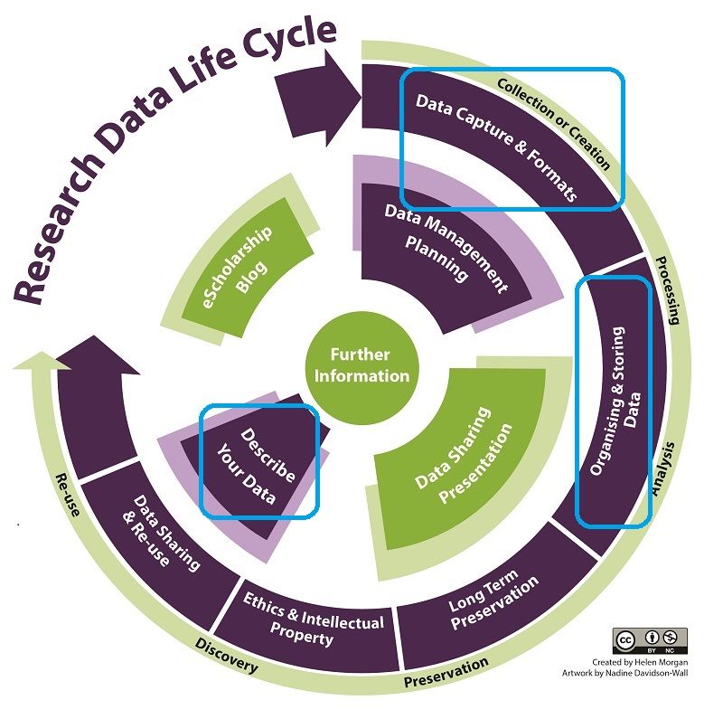
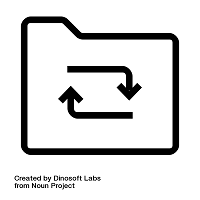
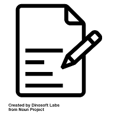
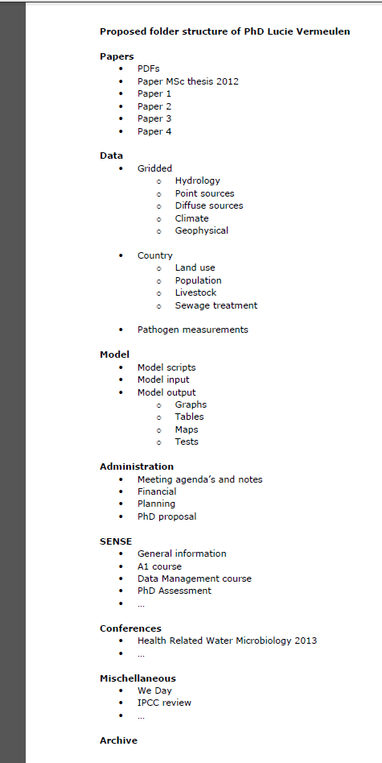
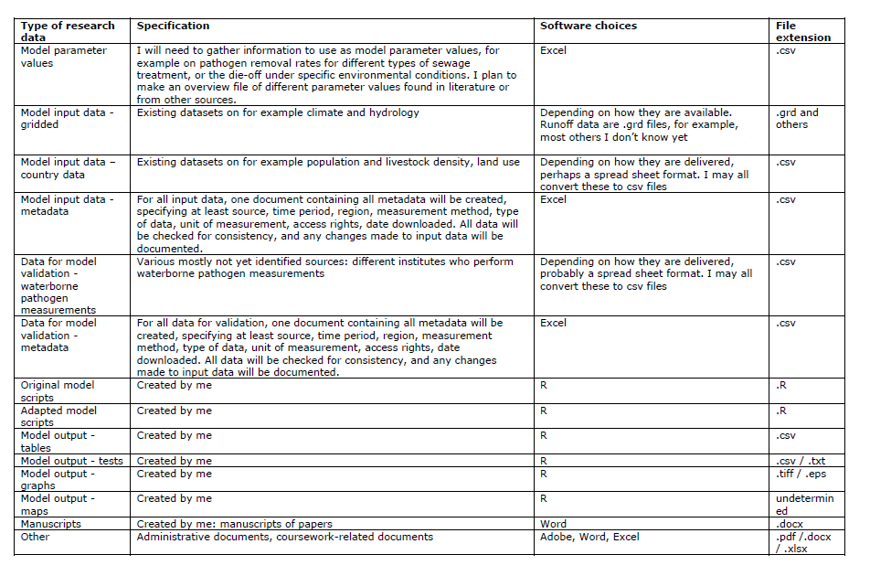
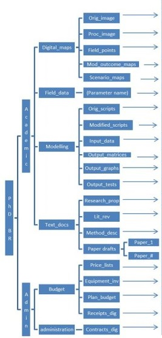
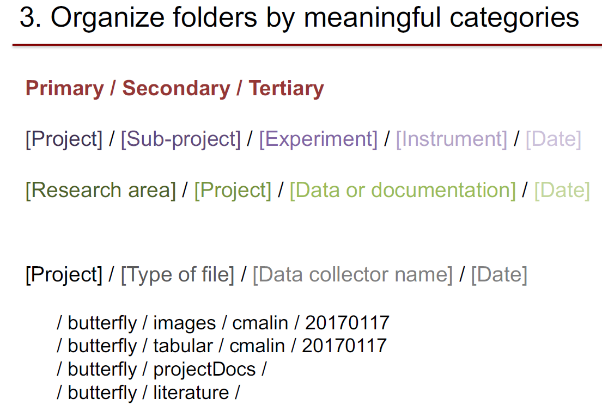

<!-- $theme: default-->
<!-- page_number: true -->
<!-- $size: 16:9 -->

# Organiser efficacement ses données
# Document de cours
**Urfist Bordeaux**
5 mars 2018
Matériel du cours en ligne [ici](https://github.com/fflamerie/organisation_donnees_2018)
<small>
*Frédérique Flamerie*
*chargée de mission science ouverte/données de la recherche*
*Université de Bordeaux - Direction de la Documentation*
</small>


---


# Introduction aux fondamentaux de la gestion de données de recherche
## La petite image :  anecdotes - rions un peu (jaune)

---

**Anecdote "rions un peu (jaune)" 1**


<!-- *footer : Source : Dombrowski, Q. (2009). It happens every year. Repéré à https://www.flickr.com/photos/quinnanya/3239528185/ -->


---

**Anecdote "rions un peu (jaune)" 2**


<!-- *footer : Source : Higman, R. & Teperek, M. (2017, 11 janvier). Template Research Data Management Workshop For Stem Researchers. https://doi.org/10.5281/zenodo.239090 -->


---

**Anecdote "rions un peu (jaune)" 3**

>I was reduced to blowing up figures on the copier and drawing pencil lines across the image. [...] Alas, too much time had gone by since the paper was published in 2001 and our colleague was now suffering from badly failing eye sight, the student who executed the work and provided the data equation had moved on and contact had been lost.


Source : Brewer, P. (2017, 14 septembre). “Do You Expect Me to Just Give Away My Data?” _Editors’ Vox_. Repéré à https://eos.org/editors-vox/do-you-expect-me-to-just-give-away-my-data


---

## La grande image : cycle de vie des données et ce qui est couvert par la formation



<!-- *footer : Adapté de : Morgan, H. (2017). Research Data Management. Repéré à http://libguides.library.cqu.edu.au/researchdatamanagement -->


---

## Le vif du sujet : formats de fichier

* Comment distinguez-vous les formats de fichiers?
* Quelle(s) typologie(s) connaissez-vous? utilisez-vous?


---

### Rappel terminologique

> A file format is a way of **encoding information** within a computer file. A program or application must be able to recognise the file format in order to access data within the file.

Source : The University of Edinburgh. (n.d.). File formats and transformation. _MANTRA Research Data Management Training_. Repéré à http://mantra.edina.ac.uk/fileformatandtransformation/


---

### Typologie 1 : fichiers binaires/fichiers texte

> Filetypes are based on either text or binary encoding.
>Text files are machine-readable through a character encoding standard such as ASCII or Unicode. Binary files can only be read by **applicable software**, and may be proprietary. Only binary formats can be executed. Some files may contain both binary and text (such as Rich Text Format - .rtf files).

Source :  The University of Edinburgh. (n.d.). File formats and transformation. _MANTRA Research Data Management Training_. Repéré à http://mantra.edina.ac.uk/fileformatandtransformation/

Les fichiers texte présentent ainsi notamment les avantages suivants.

* Ils sont lisibles facilement à la fois par des **humains** et par des **machines**,
* car ils peuvent être ouverts par une grande variété d'applications (un **éditeur de texte** suffit), avec n'importe quel système d'exploitation ;
* ils sont ainsi également peu sujets à l'obsolescence.

---


* Pour un même type de fichier, pourriez-vous citer un couple fichier binaire/texte?
* Et comment convertir l'un en l'autre (dans le sens binaire :arrow_right_hook: texte bien sûr)?


---


### Typologie 2 : formats ouverts/fermés

> Files in proprietary formats usually must be opened by the software in which they were created. Someone without a licence to the software may not be able to open the file at all. Open formats, in which the software company or collective publishes the format rather than keeps it proprietary, are more likely to be readable by more than one application.

Source :  The University of Edinburgh. (n.d.). File formats and transformation. _MANTRA Research Data Management Training_. Repéré à http://mantra.edina.ac.uk/fileformatandtransformation/


---


Les formats fermés sont tous propriétaires ; en revanche tous les formats ouverts ne sont pas non-propriétaires. Un exemple?

Ressource complémentaire sur les formats ouverts/fermés : Projet DoRANum. (2017). Les formats ouverts et fermés [Fiche synthétique]. Repéré à http://doranum.fr/wp-content/uploads/FS2_formats_ouverts_fermes_V1.pdf


---
### Autres caractéristiques à prendre en compte : cryptage/décryptage
Si la clé de décryptage d'un fichier est perdue, il peut être impossible d'accéder aux données du fichier, le rendant inutilisable.


### Autres caractéristiques à prendre en compte : compression avec/sans perte
Les formats qui compressent l'information permettent de produire des fichiers de dimensions moins volumineuses, mais la compression peut parfois entraîner des pertes de données irréversibles. On distingue ainsi les formats de compression avec/sans perte d'information à la décompression.

---
<small>

>Zip (.zip) is a de facto standard compression format that is used on Windows, Macintosh, Linux and Unix platforms, though there are others, sometimes specific to a particular operating system. A self-executing zip file (.exe) should not be used if the file is to be decompressed on another operating system.
>
>Zip is a "lossless" type of compression, which means the file should be identical to the original once unzipped. There are also "lossy" types of compression associated with some multimedia file formats, which may result in some distortion or loss of quality/fidelity when played.
>
>Tar (tape archive) files are commonly used in Unix / Linux to bundle a set of files into one. Tar files may also be zipped to reduce the file size (.tar.Z or tar.gz or .tar.bz2). In Windows environments the zip file can be used for the same purpose - to bundle files together, with or without compression, or with more or less compression. Utilities for tar files in Windows also exist.
>
>Lossiness can be one trade-off of compression. Another is the processing time it takes to compress/decompress before or during use, or the amount of computing resource this takes, in the case of very large files or shared servers.


Source : The University of Edinburgh. (n.d.). File formats and transformation. _MANTRA Research Data Management Training_. Repéré à http://mantra.edina.ac.uk/fileformatandtransformation/


----

### Récapitulatif 1 : les formats à privilégier

Récapitulons les caractéristiques des formats les plus susceptibles d'être accessibles à l'avenir (et donc à privilégier pour votre activité de recherche).

* non-propriétaire
* norme ouverte et documentée
* d'une utilisation courante dans la communauté scientifique
* représentation standard (ASCII, Unicode)
* non crypté
* non compressé

**Liste de vérification** pour choisir un format approprié

University of Leicester. (n.d.). File formats and software. _University of Leicester_. Repéré à https://www2.le.ac.uk/services/research-data/create-data/file-formats


**Tableau synthétique** des formats à privilégier

UK Data Service. (n.d.). Recommended formats. _UK Data Service_. Repéré à https://www.ukdataservice.ac.uk/manage-data/format/recommended-formats


----

### Et maintenant?
Commençons tout de suite à essayer de mettre en pratique ces principes, en nous efforçant de produire des fichiers correspondant à ces critères dans le cadre de la formation.

---

# Documenter - organiser - caractériser

  


---

## Pourquoi?
* S'aider soi-même et
* aider les autres à **comprendre** et **réutiliser** les données.
* Définir des règles = imposer des contraintes ou éviter à soi-même et aux autres de se demander (et se demander à nouveau 3 semaines après, et se demander encore des mois plus tard) comment faire?
* Documenter = nécessaire (mais non suffisant) pour assurer un minimum de reproductibilité, et démontrer son honnêteté intellectuelle et scientifique : enjeux de **traçabilité** et d'**intégrité**.


Encore plus de bénéfices : University of Leicester. (n.d.). Organise data. _University of Leicester_. Repéré à https://www2.le.ac.uk/services/research-data/organise-data


---

Vous en êtes convaincus puisque vous êtes ici.

Pour convaincre vos collègues en 4 pages  : Markowetz, F. (2015). Five selfish reasons to work reproducibly. _Genome Biology_, _16_, 274. https://doi.org/10.1186/s13059-015-0850-7


>At the lowest level, working reproducibly just means avoiding beginners’ mistakes. Keep your project organized, name your files and directories in some informative way, store your data and code at a single backed-up location.

Et les 5 raisons :
>* Reason number 1: reproducibility helps to avoid disaster
>* Reason number 2: reproducibility makes it easier to write papers
>* Reason number 3: reproducibility helps reviewers see it your way
>* Reason number 4: reproducibility enables continuity of your work
>* Reason number 5: reproducibility helps to build your reputation


---

# Documenter


Documenter =
* décrire
* contextualiser


Pour :
* retrouver
* citer (créditer)
* utiliser
* gérer

Documenter = créer des données sur des données = créer des métadonnées

---


Comment documentez-vous vos données?
La question porte sur le fond (quelles informations créez-vous ou enregistrez-vous?) et sur la forme (où et comment enregistrez-vous ces données?)


---

## Documentation et métadonnées, le formel et l'informel

On peut distinguer les métadonnées formelles et informelles.

* Métadonnées non formelles = documentation en **texte libre** rédigée en **langage naturel** = lisible par des **humains**
* Métadonnées formelles =  documentation **organisée** et structurée, en recourant si possible à des **vocabulaires contrôlés**, des normes = lisible par des **machines** (et par des humains)

<small>Voir : Strasser, C. (2015). _Research Data Management_. National Information Standards Organization. Repéré à http://www.niso.org/apps/group_public/download.php/15375/PrimerRDM-2015-0727.pdf</small>


>Documentation is sometimes considered a form of metadata, because it is information about data, and when it is very structured it can be. The importance of metadata lies in the potential for machine-to-machine interoperability, providing the user with added functionality, or 'actionable' information.

Source : The University of Edinburgh. (n.d.). Documentation, metadata, citation. _MANTRA Research Data Management Training_. Repéré à http://mantra.edina.ac.uk/documentation_metadata_citation/


---

Un exemple : la date

| Informel | Formel | Encore plus formel
:---- | :---- | :----
Ce fichier a été créé le 19 janvier 2018 | Date de création : 19/01/2018 |`<dc:created>2018-01-19</dc:created>`

Normes utilisées dans l'exemples encore plus formel :
- Dublin Core,
- ISO 8601 pour la date.

Un exemple réel et commenté de Dublin Core : voir "Exemple de standard" :  Projet DoRANum. (n.d.). Métadonnées, standards et formats [Fiche synthétique]. _DoRANum_. Repéré à http://doranum.fr/fiche-synthetique-metadonnees-standards-formats/


---

### Un (tout petit) peu plus sur le formel
Les métadonnées peuvent être regroupées en 3 grands types.

* Métadonnées **descriptives** - champs communs tels que titre, auteur, identifiant, date, ou encore résumé, mots-clé, etc. -  pour **retrouver** et **citer**
* Métadonnées **administratives** - métadonnées relatives à la préservation, aux droits et aux spécificités techniques (formats) - pour **utiliser** et **gérer**
* Métadonnées de **structure** - relations entre les différentes composantes d'un jeu de données par exemple (schéma décrivant les relations entre les tables d'une base de données par exemple) - pour **utiliser** et **gérer**

Source : The University of Edinburgh. (n.d.). Documentation, metadata, citation. _MANTRA Research Data Management Training_. Repéré à http://mantra.edina.ac.uk/documentation_metadata_citation/


---

### Un (tout petit) peu plus sur l'informel : le cahier de laboratoire

Pour en savoir plus sur ce mode de documentation, spécifique à certaines disciplines et que l'on n'évoquera pas aujourd'hui, voir écrans 12-16 de :

The University of Edinburgh. (n.d.). Documentation, metadata, citation. _MANTRA Research Data Management Training_. Repéré à http://mantra.edina.ac.uk/documentation_metadata_citation/.

Le Gurdon Institute propose des critères de choix et un **tableau comparatif** de différents outils disponibles, voir :

The Gurdon Institute. (2018). Electronic Lab Notebooks - for prospective users. _The Gurdon Institute_. Repéré à https://www.gurdon.cam.ac.uk/institute-life/computing/elnguidance?mc_cid=7dce7efa97&mc_eid=[UNIQID]


---

### Un peu plus sur l'informel : le fichier  `readme`


<small>Source : Samuk, K., Xue, J., &amp; Rennison, D. J. (2018, 2 février). _Data from: Exposure to predators does not lead to the evolution of larger brains in experimental populations of threespine stickleback_ [Dataset]. https://doi.org/10.5061/dryad.dh3h417</small>

---

Aujourd'hui nous allons nous concentrer sur un mode de documentation simple et utilisable dans tous les contextes, pour tous les projets quelles que soient leurs dimensions, le fichier `readme`.


**Commentaire de fichiers `readme`**

---

Nous allons discuter 2 modèles pour créer un fichier  `readme` au niveau d'un jeu de données :

* Modèle de Delft

4TU Centre for Research Data. (2017, décembre). Guidelines for creating a README file. Repéré à http://researchdata.4tu.nl/fileadmin/editor_upload/pdf/README/Guidelines_for_creating_a_README_file.pdf

* Modèle de Cornell

Cornell Research Data Management Service Group. (n.d.). Guide to writing « readme » style metadata. _Research Data Management Service Group_. Repéré à https://data.research.cornell.edu/content/readme


---

#### Le modèle de readme de Delft
Les 3 points de **bonne pratique** du modèle Delft :

>* Créez 1 readmefile pour chaque jeu de données.
>* Nommez le fichier **README**, pas readme, read_me, ABOUT, etc.
>* Ecrivez votre document `readme` comme un fichier texte simple ; enregistrez-le en  **README.txt** ou **README.md** si vous écrivez en Markdown. Ou utilisez **README.pdf** si la mise en forme est importante pour votre fichier.

NB **jeu de données**  dans ce contexte =

* 1 fichier,
* ou 1 ensemble de fichiers reliés entre eux et formatés de façon identique,
* ou 1 ensemble de fichiers regroupés logiquement ensemble (ex : 1 collection de scripts Matlab).


---

**La structure** - NB chaque item comprend des éléments **obligatoires** et facultatifs, on cite seulement ici le détail de la section 1, c'est surtout celle-ci que nous allons essayer de compléter aujourd'hui.

>1. _Introductory information_
>
> * **Title of the dataset**
> * **For each file or group of similar files, a short description of what data it contains**
> * Explain the file naming convention, if applicable
> * Format of the file if not obvious from the file name
> * If the data set includes multiple files that relate to each other, the relationship between the files or a description of the file structure that holds them
> * Contact information; in case users have questions regarding the data files
>
>2. _Methodological information_
>3. _Data specific information_
>4. _Sharing and Access information_


---

#### Le modèle de readme de Cornell
Les bonnes pratiques en plus

>* Nommez le `readme` de façon à ce qu'il puisse être facilement associé avec les données qu'il décrit.
>* Formatez le document de façon à ce qu'il soit facile à comprendre (_i. e._ séparez les éléments d'information importants par des lignes blanches, plutôt que de rassembler toutes les informations dans un seul long praragraphe).
>* Formatez des fichiers `readme` multiples de façon identique ; présentez les informations dans le même ordre, en utilisant la même terminologie.
> * Utilisez des formats de date normalisés. Format suggéré : norme  W3C/ISO 8601, qui définit la notation normalisée internationale  : YYYYMMDD  ou YYYYMMDDThhmmss.
> * Suivez les conventions scientifiques de votre discpline pour les termes taxonomiques, géospatiaux et géologiques. Autant que possible, utilisez des termes de taxonomie et vocabulaires standardisés.


---


Rappel :  définition vocabulaire contrôlé

>Un vocabulaire contrôlé est un ensemble organisé de mots et expressions utilisés pour indexer du contenu et/ou le retrouver par navigation ou recherche. Typiquement, il inclut des termes préférentiels et leurs variantes et opère dans un périmètre défini ou décrit un domaine spécifique.

Source : Confederation of Open Access Repositories. (2018). Vocabulaires contrôlés. Repéré à https://www.coar-repositories.org/files/coar-cv-infog-f_27052042-3.pdf


---

Le modèle de `readme` de Cornell est plus détaillé, il inclut notamment un inventaire exhaustif des fichiers et des informations concernant les versions des fichiers.

On mentionne ici seulement la structure générale ; comme pour le modèle de Delft certains éléments sont **obligatoires** et d'autres facultatifs. Les items sont globalement les mêmes, l'ordre des rubriques change en revanche. Cornell fournit un modèle téléchargeable de ce fichier `readme`.

> * General information
> * Data and file overview
> * Sharing and access information
> * Methodological information
> * Data-specific information

---

## Le formel et l'informel en pratique
### Comment?
Les métadonnées peuvent être renseignées de différentes façons :
* dans un nom de fichier,
* dans un fichier `readme`,
* dans un fichier XML,
* dans une base de données,
* ou encore dans les fichiers de données eux-mêmes.

Lorsque vous devrez choisir comment les enregistrer, prenez en compte :
* l'expertise dont vous disposez,
* la complexité de votre projet,
* vos collègues,
* votre propre niveau de confort.

Traduit de : IAP. (2016). Research Data Management 101: The Lifecycle of a Dataset. Communication présentée au MIT, MIT Libraries. Repéré à https://libraries.mit.edu/data-management/files/2014/05/rdm101_IAP2016_20160112-1.pdf

---

Nous avons évoqué brièvement tout à l'heure le _Dublin Core_, qui est un schéma de métadonnées standardisé.

Dans la mesure du possible, les schémas standardisés comme le _Dublin Core_ sont à privilégier, car

* ils assurent que vous ayez un ensemble d'informations complet et normalisé,
* ils permettent d'organiser et de combiner votre jeu de données plus facilement avec d'autres.


Certains sont généralistes, comme le _Dublin Core_, d'autre spécifiques à des disciplines. Ces derniers sont à privilégier, car ils sont plus précis, et utilisés au sein de votre communauté.

---

De premières ressources pour les connaître et les trouver.
* Aperçu synthétique de premier niveau

Projet DoRANum. (n.d.). Métadonnées, standards et formats [Fiche synthétique]. _DoRANum_. Repéré à http://doranum.fr/fiche-synthetique-metadonnees-standards-formats/

* Exemples de standards de métadonnées et d'ontologies, ainsi qu'une étude de cas dans le domaine biomédical

Stanford. (n.d.). Advanced metadata. _Stanford Libraries_. Repéré à http://library.stanford.edu/research/data-management-services/data-best-practices/creating-metadata/advanced-metadata


* Répertoire complet, organisé par discipline et recensant à la fois des modèles et des outils

Research Data Alliance. (n.d.). Metadata Directory. Repéré à http://rd-alliance.github.io/metadata-directory/tools/


---

### A quel niveau?
Qu'elle soit formelle ou informelle, on a vu que la documentation pouvait être positionnée à différents niveaux.
On retiendra 3 niveaux à documenter, pour lesquels produire, sous une forme à adapter, de la documentation.

* Niveau 1 : niveau du projet
* Niveau 2 : niveau du fichier ou de la base de données
* Niveau 3 : niveau de la variable ou de l'objet


Source : The University of Edinburgh. (n.d.). Documentation, metadata, citation. _MANTRA Research Data Management Training_. Repéré à http://mantra.edina.ac.uk/documentation_metadata_citation/

---

>* Project level: what the study set out to do, how it contributes new knowledge to the field, what the research questions/hypotheses were, what methodologies were used, what sampling frames were used, what instruments and measures were used, etc. A complete academic thesis normally contains this information in detail, but a published article may not. If a dataset is shared, a detailed technical report will need to be included for the user to understand how the data were collected and processed. You should also provide a sample bibliographic citation to indicate how you would like secondary users of your data to cite it in any publications, etc.
>* File or database level: how all the files (or tables in a database) that make up the dataset relate to each other; what format they are in; whether they supercede or are superceded by previous files. A readme.txt file is the classic way of accounting for all the files and folders in a project.
>* Variable or item level: the key to understanding research results is knowing exactly how an object of analysis came about. Not just, for example, a variable name at the top of a spreadsheet file, but the full label explaining the meaning of that variable in terms of how it was operationalised.


Source : The University of Edinburgh. (n.d.). Documentation, metadata, citation. _MANTRA Research Data Management Training_. Repéré à http://mantra.edina.ac.uk/documentation_metadata_citation/

---

Pour le niveau "Projet", voir les ressources de Stanford :

Stanford Libraries. (n.d.). Basic approach to metadata. _Stanford Libraries_. Repéré à http://library.stanford.edu/research/data-management-services/data-best-practices/creating-metadata/basic-approach-metadata

Stanford Libraries. (n.d.). Case study: Basic metadata. _Stanford Libraries_. Repéré à http://library.stanford.edu/research/data-management-services/case-studies/case-study-basic-metadata


---

# Proposition de démarche
Pour produire cette documentation, tout en explicitant votre fonctionnement actuel, nous vous proposons de partir d'une grille d'organisation, en partie inspirée de : Malinowski, C. (2017, 18 janvier). Data Management: File Organization. MIT Libraries. Repéré à https://libraries.mit.edu/data-management/files/2014/05/FileOrgSlides_20170118sm.pdf

A vous de l'adapter à vos modes de travail et vos logiques d'organisation. A vous de la découper en plusieurs morceaux ou conserver une vue synoptique. A vous de la compléter sous forme papier/et ou électronique.

Les grandes étapes de l'organisation des fichiers :

* structurer,
* nommer,
* versionner,

et toujours en toile/tâche de fond caractériser et documenter.
 


---

Les grands principes :
* investir un peu de temps en anticipant, pour ne pas en perdre beaucoup par la suite,
* établir un système rentable : en faire ni trop ni pas assez,
* établir un système efficace : trouver l'organisation qui fonctionne pour VOUS,
* et en fonction du contexte, une organisation qui convienne aussi à votre équipe, vos collègues, etc.

---


## Diagnostic : étape 1


----

# Organiser niveau 1/2 : structurer
On peut distinguer 2 modes de structure :

* hiérarchique, par dossier et sous-dossier,
* fondée sur des mots clé,

présentant chacun des avantages et des inconvénients, que nous traduisons dans le tableau récapitulatif ci-dessous.


Voir : Malinowski, C. (2017, 18 janvier). Data Management: File Organization. MIT Libraries. Repéré à https://libraries.mit.edu/data-management/files/2014/05/FileOrgSlides_20170118sm.pdf


---
<small>

| Type d'organisation | Avantages | Inconvénients |
:---- | :---- | :---- |
| Organisation hiérarchique | D'un usage familier et largement répandu.</br> Représente bien la structure de l'information.</br>Les items similaires sont stockés ensemble.</br>Les sous-dossiers peuvent fonctionner comme des listes de tâches. | Etonnament difficile à mettre en place.</br>Equilibre entre largeur et profondeur difficile à trouver.</br>Chaque item ne peut avoir qu'une seule place.</br>Si la hiérarchie ne convient plus, la réorganisation est chronophage.
| Organisation par mots clé  | Les items peuvent avoir plusieurs places.</br>Peut être plus rapide et plus facile à mettre en place.</br>Dans un contexte collaboratif, un tel système peut être plus facile à combiner. | Les fichiers ne sont pas stockés de cette façon.</br>Si l'item ne se voit pas assigner un mot clé correctement au départ, il peut être difficile de le retrouver.</br>Risque accru d'incohérence.</br>Représente moins bien la structure de l'information.


---

Ces 2 systèmes peuvent se compléter (et se combiner) :
* l'organisation hiérarchique permet de **classer** et de ranger mais impose de **choisir**,
* les mots clé permettent de **caractériser** (et d'intégrer ces caractéristiques avec les items si les mots clé sont saisis sous forme de métadonnées incorporées aux fichiers).

Le MIT propose un guide détaillé comportant notamment une sélection de ressources, voir :

Smith, K. & Malinowski, C. (n.d.). Tagging and Finding Your Files. _MIT Libraries_. Repéré à https://libguides.mit.edu/c.php?g=176344&p=1160756


Pour certaines données, les données bibliographiques gérées dans un logiciel de gestion bibliographique par exemple, une organisation par mots clé peut être facilement (et efficacement) paramétrée, voir :

Flamerie, F. (2015, 7 décembre). Comment organiser sa bibliothèque ? [Billet]. _Le blog Zotero francophone_. Repéré à https://zotero.hypotheses.org/756


Aujourd'hui nous allons surtout considérer l'organisation hiérarchique, par dossier.

---


## Diagnostic : étape 2 : structure


---
## Structures de dossiers : exemples

**Exemple structure de dossiers 1**


Source : Vukovic, N. (n.d.). Setting up an Organised Folder Structure for Research Projects. _Nikola_. Repéré à http://nikola.me/folder_structure.html


---

**Exemple structure de dossiers 2**



Source : Vermeulen, L. C. (n.d.). Data Management Plan. Repéré à https://www.wur.nl/upload_mm/d/4/9/fec82c96-d901-49c2-8205-c40a2e819ee7_Data_Management_Plan_Lucie_Vermeulen.pdf


---

Dans le même document, voir aussi le tableau des fichiers




---

**Exemple structure de dossiers 3**



Source : Wageningen University & Research. (2015, 9 février). Organising files and folders. _Wageningen University & Research_. Repéré à https://www.wur.nl/en/Expertise-Services/Data-Management-Support-Hub/Browse-by-Subject/Organising-files-and-folders.htm


---


Structurer des dossiers : quelles bonnes pratiques ces systèmes mettent-ils en oeuvre?


---

## Principes pour définir une structure de dossiers
Nous proposons de définir la démarche suivante.

1. Etape 1 : caractériser
2. Etape 2 : inventorier et grouper
3. Etape 3 : structurer et nommer

NB nous avons déjà fait une partie du travail en rédigeant la description du projet.

Adapté de :

Magle, C. T. (2016). Data and Donuts: Data organization. Repéré à https://www.slideshare.net/CTobinMagle/data-and-donuts-data-organization

Malinowski, C. (2017, 18 janvier). Data Management: File Organization. MIT Libraries. Repéré à https://libraries.mit.edu/data-management/files/2014/05/FileOrgSlides_20170118sm.pdf


---

### Etape 1 : caractériser
Identifier les principales caractéristiques de votre projet vous permettra d'identifier comment répartir vos données en différentes catégories, ou attributs.
L'organisation de premier niveau est l'attribut le plus important.

### Etape 2 : inventorier et grouper
A partir de la liste des types de données et de fichiers, il s'agit ensuite de déterminer et hiérarchiser les critères pertinents pour les regrouper. Ces critères varient d'une personne à l'autre, d'un projet à l'autre, d'un contexte à l'autre.

Exemples de critère :

* localisation,
* date,
* type de fichier,
* type de donnée,
* étape d'un processus,
* méthode,
* sujet.

---

**Exemple structure de dossiers 4**


Source : Magle, C. T. (2016). Data and Donuts: Data organization. Repéré à https://www.slideshare.net/CTobinMagle/data-and-donuts-data-organization

---

**Exemple structure de dossiers 5**



Source : Malinowski, C. (2017, 18 janvier). Data Management: File Organization. MIT Libraries. Repéré à https://libraries.mit.edu/data-management/files/2014/05/FileOrgSlides_20170118sm.pdf

---

**Exemple structure de dossiers 6**


Source : Noble, W. S. (2009). A Quick Guide to Organizing Computational Biology Projects. _PLoS Computational Biology_, _5_(7), e1000424. https://doi.org/10.1371/journal.pcbi.1000424


Cet exemple combine des critères logiques et chronologiques.

---

>Within a given project, I use a top-level organization that is logical, with chronological organization at the next level, and logical organization below that. A sample project, called msms, is shown in Figure 1. At the root of most of my projects, I have a data directory for storing fixed data sets, a results directory for tracking computational experiments peformed on that data, a doc directory with one subdirectory per manuscript, and directories such as src for source code and bin for compiled binaries or scripts.

Source : Noble, W. S. (2009). A Quick Guide to Organizing Computational Biology Projects. _PLoS Computational Biology_, _5_(7), e1000424. https://doi.org/10.1371/journal.pcbi.1000424


---

### Etape 3 : structurer et nommer
Il s'agit maintenant de traduire les éléments d'organisation définis aux étapes 1 et 2 dans une structure de dossiers.

Rappel des objectifs :

* permettre aux utilisateurs de retrouver facilement les données [utilisateurs = vous aujourd'hui, vous dans 5 ou 10 ans, vos collègues, autres?],
* éviter la duplication des fichiers.

---

#### Bonnes pratiques pour la définition d'une arborescence

* Vérifiez s'il existe des conventions ou procédures propres à votre discipline ou votre structure.
* Trouvez (du moins cherchez) un équilibre entre la profondeur et la largeur (cf. _supra_) : ne créez pas trop de sous-sous-sous-dossier, qui sont peu accessibles.
* S'ils sont hétérogènes, ne pas dépasser un nombre raisonnable de fichiers par dossier contribuera à rendre chacun de vos dossiers plus manipulable et navigable.
* Commencez avec un nombre limité de dossiers et créez ensuite les dossiers plus spécifiques.
* Déplacez les fichiers sur lesquels vous ne travaillez plus à un emplacement différent, dans un dossier OLD ou ARCHIVES par exemple.
* Evitez les catégories qui se chevauchent.

| A éviter | A privilégier |
|:---- | :----
| Manuscript/Data </br> Presentations/Data </br>ProgressReports/Data| Data</br>PrésentationData</br>RawData

Traduit et adapté de : Malinowski, C. (2017, 18 janvier). Data Management: File Organization. MIT Libraries. Repéré à https://libraries.mit.edu/data-management/files/2014/05/FileOrgSlides_20170118sm.pdf


---

#### Bonnes pratiques pour le nommage des dossiers
* Conservez des noms brefs et significatifs.
* Si vous incluez des numéros, assurez-vous d'utiliser au moins 2 nombres, _i. e._ 01, 02, etc. plutôt que 1, 2, etc.
* Bannissez les caractères spéciaux et accentués.
* Remplacez les espaces par des délimiteurs.
* Utilisez des délimiteurs de façon déterminée et cohérente. Plusieurs options sont possibles :

  * le `-`,
  * le `_`,
  * le système dit `CamelCase`.

Les recommandations concernant ces différents systèmes peuvent varier ; il s'agit avant tout de préférences personnelles.
NB la casse n'est pas prise en compte dans tous les systèmes, aussi faut-il considérer que `MyFile` et  `myfile` sont équivalents ; la majuscule n'est pas discriminante.

En résumé :
>Be Clear, Concise, Consistent, Correct, Conformant

Source citation : Malinowski, C. (2017, 18 janvier). Data Management: File Organization. MIT Libraries. Repéré à https://libraries.mit.edu/data-management/files/2014/05/FileOrgSlides_20170118sm.pdf

---
##### Ressources utilisées

Magle, C. T. (2016). Data and Donuts: Data organization. Repéré à https://www.slideshare.net/CTobinMagle/data-and-donuts-data-organization

Malinowski, C. (2017, 18 janvier). Data Management: File Organization. MIT Libraries. Repéré à https://libraries.mit.edu/data-management/files/2014/05/FileOrgSlides_20170118sm.pdf

University of Leicester. (n.d.). Naming files and folders. _University of Leicester_. Repéré à https://www2.le.ac.uk/services/research-data/organise-data/naming-files

Wageningen University & Research. (2015, 9 février). Organising files and folders. _Wageningen University & Research_. Repéré à https://www.wur.nl/en/Expertise-Services/Data-Management-Support-Hub/Browse-by-Subject/Organising-files-and-folders.htm

---

## Structurer en pratique


### Diagnostic : étape 2 : structure : nouvelle


---

### 2 exemples supplémentaires de démarche de structuration de dossiers

* Sciences humaines : leçon _Programming historian_

Baker, J. (2014). Preserving Your Research Data. _Programming Historian_. Repéré à https://programminghistorian.org/lessons/preserving-your-research-data


* Informatique

Wallis, T. (2014, 16 janvier). Setting up a project directory. _Practical Vision Science_. Repéré à https://tomwallis.info/2014/01/16/setting-up-a-project-directory/


---


### Automatiser : structure et inventaire

---

# Organiser niveau 2 : nommer

## Pourquoi (bien) nommer (les fichiers)?
* Les fichiers peuvent être distingués les uns des autres au sein du dossier dans lequel ils sont classés, et indépendamment de ce dossier.
* Il est plus facile de localiser les fichiers et de naviguer entre eux.
* Les fichiers peuvent être retrouvés non seulement par leur créateur mais également par d'autres utilisateurs.
* Les fichiers peuvent être triés selon un ordre logique.
* Les fichiers ne sont pas accidentellement écrasés ou supprimés.
* Les différentes versions des fichiers peuvent être identifiées.
* Si les fichiers sont déplacés sur une autre plateforme de stockage, leur nom va conserver des informations de contexte utiles.
* Un nommage correct évite la confusion lorsque plusieurs personnes travaillent sur des fichiers partagés.
* Un nomage correct facilite l'envoi du lien vers un fichier plutôt que l'envoi du fichier lui-même.

Traduit et adapté de :
The University of Edinburgh. (n.d.). Organising data. _MANTRA Research Data Management Training_. Repéré à http://mantra.edina.ac.uk/organisingdata/

Division of Technology, Information and Library Services - Queensland University of Technology. (2015). TILS Document Naming Convention. _Queensland University of Technology_. Repéré à https://www.library.qut.edu.au/about/management/documents/QUTTILSDocNamingConvention.pdf


---


## Diagnostic : étape 3 : nommage

---


## Quizz


---


## Nommage des fichiers : exemples

**Exemple nommage des fichiers 1 (suite exemple 3 dossiers)**


<small>Source : Wageningen University &amp; Research. (2015, 9 février). Organising files and folders. _Wageningen University &amp; Research_. Repéré à https://www.wur.nl/en/Expertise-Services/Data-Management-Support-Hub/Browse-by-Subject/Organising-files-and-folders.htm</small>

---

**Exemple nommage des fichiers 2**

Le document de TILS (Université du Queensland) comporte une documentation (listes des préfixes, etc.) du schéma de nommage.


Source : Division of Technology, Information and Library Services - Queensland University of Technology. (2015). TILS Document Naming Convention. _Queensland University of Technology_. Repéré à https://www.library.qut.edu.au/about/management/documents/QUTTILSDocNamingConvention.pdf


---

**Exemple nommage des fichiers 3**


Source : Malinowski, C. (2017, 18 janvier). Data Management: File Organization. MIT Libraries. Repéré à https://libraries.mit.edu/data-management/files/2014/05/FileOrgSlides_20170118sm.pdf


---


Nommer des fichiers : quelles bonnes pratiques ces exemples mettent-ils en oeuvre?


---

## Principes et bonnes pratiques pour nommer les fichiers

Toutes les bonnes pratiques définies pour les dossiers s'appliquent également aux fichiers. Ce qui suit s'ajoute donc à ce qui précède.

**Principe clé : vos noms de fichier doivent être lisibles et utilisables par des humains ET des machines**.

Vous vous en assurerez en définissant des noms :
* descriptifs,
* spécifiques,
* composés de segments allant du plus général au plus spécifique,
* brefs (pas plus de 30 carctères, de préférence moins),
* exempts d'abréviations (ou du moins d'abréviations non documentées et d'un usage non général),
* exempts d'autres `.` que celui précédant l'extension de fichier,
* cohérents.

Traduit et adapté de :
Magle, C. T. (2016). Data and Donuts: Data organization. Repéré à https://www.slideshare.net/CTobinMagle/data-and-donuts-data-organization
Malinowski, C. (2017, 18 janvier). Data Management: File Organization. MIT Libraries. Repéré à https://libraries.mit.edu/data-management/files/2014/05/FileOrgSlides_20170118sm.pdf


---

**Descriptif** = inclure des éléments tels qu'un identifiant, le nom du projet, la date, la version, etc.

**Spécifique** = non générique, afin que des fichiers d'un même projet (ou de projets différents) ne puissent pas être confondus

**Cohérent** = conserver
* tous les éléments,
* sous la même forme : par exemple pour une date ne pas indiquer tantôt YYYYMM, tantôt YYMM ou encore YYMMDD.

On peut garder le même résumé que pour les noms de dossier :
>Be Clear, Concise, Consistent, Correct, Conformant

Source : Malinowski, C. (2017, 18 janvier). Data Management: File Organization. MIT Libraries. Repéré à https://libraries.mit.edu/data-management/files/2014/05/FileOrgSlides_20170118sm.pdf

---

## Nommer en pratique


### Diagnostic : étape 3 : nommage : nouveau

---

### Une étude de cas : traitement des images


Hodge, A. & Stanford Libraries. (2015). Case study: File naming done well. _Stanford Libraries_. Repéré à http://library.stanford.edu/research/data-management-services/case-studies/case-study-file-naming-done-well


Les bibliothèques de Stanford détaille dans cette étude de cas un schéma de nommage défini pour des images.

Il va nous intéresser pour la suite, car les images font partie des objets souvent collectés par lot, et pour lesquels un renommage manuel serait fastidieux et chronophage.

---


### Automatiser : nommage par lot

---

####  Logiciels de renommage par lot
**Windows** :

* [Ant Renamer](www.antp.be/software/renamer)
* [RenameIT](sourceforge.net/prpjects/renameit)
* [Bulk Rename Utility](www.bulkrenameutility.co.uk/)

**Mac** :
* [Renamer 5](renamer.com/)
* [Name Changer](mrrsoftware.com/namechanger/)

**Linux** :
* [GNOME Commander](www.nongnu.org/gcmd/)
* [GPRename](http://gprename.sourceforge.net/)

**Unix** :
The use of the grep command to search for regular expressions

Source : The University of Edinburgh. (n.d.). Organising data. _MANTRA Research Data Management Training_. Repéré à http://mantra.edina.ac.uk/organisingdata/


---

# Organiser niveau 2 : versionner
## Versionner : anecdotes

---

**Anecdote versionner 1**


Source : Cham, J. (n.d.). _A story in file names_. Repéré à http://phdcomics.com/comics/archive.php?comicid=1323


---

**Anecdote versionner 2**


Source : Cham, J. (2012). _notFinal.doc_. Repéré à http://phdcomics.com/comics/archive.php?comicid=1531

---

## Principes et bonnes pratiques de versionnage

Il s'agit de :

* **distinguer les différentes versions** des fichiers de façon cohérente,
* identifier le **statut** de chaque version,
* comprendre (ou du moins identifier) les **modifications** effectuées entre plusieurs versions,
* définir par là-même une politique de versionnage.

Les bénéfices attendus s'expriment en termes de :
* traçabilité,
* identification,
* clarté,
* duplication réduite,
* erreurs réduites.

Traduit et adapté de : University of Leicester. (n.d.). Version control. _University of Leicester_. Repéré à https://www2.le.ac.uk/services/research-data/organise-data/version-control


---

NB Cette stratégie de contrôle de versions sera notamment influencée par les facteurs suivants :

* nombre d'utilisateurs des fichiers,
* localisation simple ou multiple des fichiers,
* nécessité de synchroniser les versions entre les utilisateurs ou les localisations.

Traduit et adapté de : UK Data Service. (n.d.). Version control and authenticity. _UK Data Service_. Repéré à https://www.ukdataservice.ac.uk/manage-data/format/versioning


---

### Distinguer les versions

Un moyen classique est de recourir à une numérotation, intégrant le cas échéant une décimale.

Le nombre ordinal distingue les changements **majeurs**, _i. e._ un changement majeur occasionne le passage de la **v01** à la **v02**.

La décimale est utilisée pour les changements **mineurs**, _i. e._ on passe de la **v01-07** à la **v01-08** en cas de modification mineure.

---

### Identifier le statut


Quels termes utilisez-vous pour indiquer le statut d'un document, d'un fichier (ou autre)?

Comme on l'a vu dans les exemples, il convient d'éviter les termes introduisant trop de confusion comme : final, final2, etc., ou de documenter et standardiser leur usage.

---

### Premiers éléments d'une stratégie de contrôle de versions

* Déterminer combien de versions d'un fichier conserver, quelles versions conserver, pour combien de temps, et comment les organiser.
* Expliciter si nécessaire les **critères** de changement de version : que considérer comme un changement majeur ? comme un changement mineur ?
* Les versions _master_ des données, identifiées en tant que telles, sont toujours conservées. Afin de se prémunir d'une modification ou d'une suppression éventuelle de ces fichiers, une bonne pratique peut être d'en interdire la modification, en créant une version "lecture seule du fichier".

Rappel : Windows : `clic-droit > Propriétés > Sécurité`.

* Interdire la modification des versions définitives peut aussi permettre de se prémunir de fâcheux accidents.

---

* Identifier les versions "jalons" (_milestone versions_) à conserver.
* Les versions intermédiaires pourront être supprimées.
* Identifier une localisation unique pour le stockage des versions _master_ et "jalons".

Traduit et adapté de : UK Data Service. (n.d.). Version control and authenticity. _UK Data Service_. Repéré à https://www.ukdataservice.ac.uk/manage-data/format/versioning


>Why should you discard or delete obsolete versions of data files?
>Too many similar or related files may be confusing, both to yourself and to anyone else wanting to access or use your data. You may think that you know which data file is which but that may not always be the case as time passes and the number of different file versions increase. It is easier to maintain a manageable number of versions with a clear naming structure. As long as the original 'raw' or definitive copy is retained and processing is well documented, the intermediate working files can and should be discarded.

Source : The University of Edinburgh. (n.d.). Organising data. _MANTRA Research Data Management Training_. Repéré à http://mantra.edina.ac.uk/organisingdata/


---

### Comment faire?
Exemples de contrôle de version intégré au nom de fichier, sous la forme [nom_du_document][numéro_de_version][statut]:

* Smith_interview_July2010_V1_DRAFT
* Lipid-analysis-rate-V2_definitive
* 2001_01_28_ILB_CS3_V6_AB_edited

Source : The University of Edinburgh. (n.d.). Organising data. _MANTRA Research Data Management Training_. Repéré à http://mantra.edina.ac.uk/organisingdata/

---

### Identifier les modifications entre plusieurs versions
Si le modèle de nommage présenté _supra_ permet d'atteindre les 2 premiers objectifs,_i. e._ distinguer les versions et identifier les versions, il est insuffisant pour identifier pourquoi on est passé d'une version à l'autre.


Comment documenter un changement de version? Fond et forme?

---

Méthode la plus simple : tenir à jour un tableau, contenant au moins les informations suivantes :
* le numéro de version,
* le nom de la personne qui a effectué le changement,
* l'objet de la modification ou la modification elle-même,
* la date de la modification.

---

**Exemple versionnage des fichiers 1 : versionnage seul**


Source : University of Leicester. (n.d.). Version control. _University of Leicester_. Repéré à https://www2.le.ac.uk/services/research-data/organise-data/version-control

---

**Exemple versionnage des fichiers 2 : versionnage + métadonnées**


Source : UK Data Service. (n.d.). Version control and authenticity. _UK Data Service_. Repéré à https://www.ukdataservice.ac.uk/manage-data/format/versioning


---

## Automatiser
Les modes de fonctionnement que nous avons vu pour le moment sont très rudimentaires et manuels. S'ils peuvent éventuellement suffire pour un nombre restreint de fichiers d'un seul utilisateur, ils peuvent s'avérer largement inefficaces dès lors que :

* vous manipulez de nombreux fichiers,
* avec d'autres utilisateurs,
* éventuellement sur des sites distants.

Il convient alors d'utiliser une application ou un service permettant de gérer automatiquement le contrôle de version.

L'un des systèmes les plus performants pour ce faire est Git, sur lequel sont fondés des services en ligne tels que GitHub, GitLab, Framagit, Bitbucket, etc.

---

Si ce système a d'abord été conçu pour le code informatique, il peut être appliqué avec profit à des projets de toute nature, comme le code civil français.

Voir : Morin, S. (2015). france.code-civil: Le code civil français sous git. Repéré à https://github.com/steeve/france.code-civil


Les bénéfices de Git/GitHub sont détaillés de façon synthétique par J. Oliver, citons les principaux items :

* reproducibilité,
* copie en ligne (et non sauvegarde si vous utilisez un service tiers tel que GitHub),
* partage,
* documentation.

Voir : Oliver, J. (2017, 25 octobre). My Favourite Tool: Git/GitHub. _Software Carpentry_. Repéré à http://software-carpentry.org//blog/2017/10/oliver-fave.html


---

**Quelques ressources pour se familiariser avec la logique d'entrepôt et GitHub**

* Exemple d'entrepôt avec des exercices pratiques, autour de l'organisation d'un pot

Coates, H. (2017, 21 avril). project-mgmt: Repository created to provide resources for learning to use GitHub for project management. Repéré à https://github.com/coateshl/project-mgmt (Ouvrage original publié en 21 avril 2017).

* Leçon du site _Programming historian_

Strien, D. van. (2016, 17 juin). An Introduction to Version Control Using GitHub Desktop. _Programming Historian_. Repéré à https://programminghistorian.org/lessons/getting-started-with-github-desktop


* Exemple d'une démarche complète _Version control_ en 2 parties

Wallis, T. (2014, 5 février). Version control Part 1: Local repository. _Practical Vision Science_. Repéré à https://tomwallis.info/2014/02/05/version-control-part-1-local-repository/
Wallis, T. (2014, 27 février). Version control Part 2: Remote repository. _Practical Vision Science_. Repéré à https://tomwallis.info/2014/02/27/version-control-part-2-remote-repository/


---

NB Prenez bien en considération les **conditions d'utilisation** des services en ligne tiers que vous utilisez, et assurez-vous qu'elles correspondent bien aux exigences liées à votre projet ou aux règles de fonctionnement de votre structure. On détaillera _infra_ quand on évoquera la sauvegarde.

* La version gratuite de GitHub ne permet ainsi pas de créer d'entrepôt privé ; la taille limite d'un entrepôt est de 1Go.
* Si vous souhaitez privilégier des outils entièrement _open source_ Framagit ou GitLab seront plus adaptés que GitHub.


Le contrôle de version est intégré dans **[Open Science Framework](https://osf.io/)**.

* Recension de Open Science Framework avec des études de cas. NB cette recension est déjà un peu datée, car de nouvelles fonctionnalités sont très régulièrement et rapidement ajoutées.

Foster, E. D. & Deardorff, A. (2017). Open Science Framework (OSF). _Journal of the Medical Library Association : JMLA_, _105_(2), 203‑206. https://doi.org/10.5195/jmla.2017.88


* Présentation de Open Science Framework avec des exemples de différents types de projet p. 12 et suivantes.

Magle, C. T. (2016). Data and Donuts: Data organization. Repéré à https://www.slideshare.net/CTobinMagle/data-and-donuts-data-organization


---

### Quelques logiciels pour gérer automatiquement le contrôle de versions
* [Git](https://git-scm.com/)
* [Subversion](https://subversion.apache.org/)
* [Mercurial](https://www.mercurial-scm.org/)
* [Methodicate](https://www.methodicate.com/) : spécifiquement créé pour la recherche : voir page d'accueil du site  :
> Methodicate is being developed by researchers from the University of Oxford and RWTH Aachen University.

---


## Diagnostic : étape 4 : versionnage : nouveau

---

# Organiser niveau 3 : les items/ les variables

Nous arrivons au niveau le plus fin de donnée, celui de l'item, de la variable.


* Ce niveau est-il pertinent pour votre projet?
* A quel type de données correspond-il?
* Comment le documentez-vous (ou le documenteriez-vous)?


---

## Les items physiques

Exemple : les échantillons de laboratoire.


Source : Higman, R. & Teperek, M. (2017, 11 janvier). Template Research Data Management Workshop For Stem Researchers. https://doi.org/10.5281/zenodo.239090


---

## Un préalable : _tidy data_

### _Tidy data_ , partons d'un exemple


Source : Magle, C. T. (2016). Data and Donuts: Data organization. Repéré à https://www.slideshare.net/CTobinMagle/data-and-donuts-data-organization

---


Cette feuille Excel ressemble-t-elle à celles que vous créez/manipulez/récupérez de vos collègues?

---


* Lorsque vous utilisez Excel, recourez-vous à l'une des pratiques suivantes?

  * Codes couleur
  * Fonction "format de cellule" (fusionner des cellules, mise en forme, format de nombre, etc.)
  * Notes
  * Formules de calcul
  * Graphiques

* Vous semblent-elles problématiques? Pourquoi?

---

  * Codes couleur = non lisibles par un ordinateur (la compréhensibilité par les humains est également limitée... )/ ajoutez plutôt une colonne pour reporter l'information qu'est censée indiquer la couleur
  * Fonction "format de cellule" = non lisible informatiquement + peut conduire à des erreurs.

> The spreadsheet software Microsoft Excel, when used with default settings, is known to convert gene names to dates and floating-point numbers. A programmatic scan of leading genomics journals reveals that approximately one-fifth of papers with supplementary Excel gene lists contain erroneous gene name conversions.
>...
> For example, gene symbols such as SEPT2 (Septin 2) and MARCH1 [Membrane-Associated Ring Finger (C3HC4) 1, E3 Ubiquitin Protein Ligase] are converted by default to ‘2-Sep’ and ‘1-Mar’, respectively.

Source : Ziemann, M., Eren, Y., & El-Osta, A. (2016). Gene name errors are widespread in the scientific literature. _Genome Biology_, _17_, 177. https://doi.org/10.1186/s13059-016-1044-7


---

  * Notes = non lisibles par un ordinateur + mélange données et métadonnées
  * Formules de calcul = à bannir des fichiers de données _master_
>If you are doing calculations in your data file, that likely means you are regularly opening it and typing into it. Doing so incurs some risk that you will accidentally type junk into your data.

Source : Broman, K. W. & Woo, K. H. (2017). Data organization in spreadsheets. _PeerJ Preprints_, _5_, e3183v1. https://doi.org/10.7287/peerj.preprints.3183v1


  * Graphiques = ne sont pas exportables + à bannir de fichiers de données _master_ au même titre que les formules de calcul

Traduit et adapté de : Magle, C. T. (2016). Data and Donuts: Data organization. Repéré à https://www.slideshare.net/CTobinMagle/data-and-donuts-data-organization


---

### Bonnes pratiques pour les données tabulaires


A partir de votre expérience et de ces exemples, quelles bonnes pratiques recommander (et appliquer) ?

---

#### Organisation générale
* 1 feuille/classeur
* 1 table/feuille
* 1 colonne = 1 variable
* 1 ligne = 1 observation
* 1 cellule = 1 information
* pas de ligne vide
* pas de colonne vide
* Ne mélangez pas les notes et les données
* Enregistrez les métadonnées dans un simple fichier texte à part = par exemple fichier `readme`
* N'oubliez pas de renseigner à la fois les codes et valeurs qui vous sont propres ET les standards utilisés pour les codes et valeurs normalisés dans un `dictionnaire de données`, aussi appelé `codebook`.

---

#### En-têtes de colonnes = noms de variables
* Utilisez des noms descriptifs - ni trop longs ni trop courts.
* Harmonisez si possible et applicable les noms de variables communes (à plusieurs fichiers, à plusieurs projets).
* Incluez si possible et applicable l'unité de mesure.
* Evitez les espaces, les nombres (en début de chaîne de caractère) et les caractères spéciaux.
* Pour les dates, considérez de saisir dans des colonnes séparées l'année, le mois, le jour, etc.
* Utilisez les abréviations les plus communément utilisées - par exemple `temp` pour température, `lat` pour latitude.

---


**Bonnes pratiques pour les données tabulaires : les noms de variable**

---

#### Données
* Enregistrez les zéros en tant que zéros.
* Utilisez une valeur appropriée pour enregistrer des données manquantes : un `blanc`,  un `-` ou `NA` peut être approprié ; les recommandations peuvent varier.
* Utilisez si possible des valeurs standardisées .
* Evitez les caractères spéciaux.
* Evitez les virgules. Elles peuvent notamment être interprétés comme un délimiteur lors d'un export .csv ; si elles servent à délimiter 2 informations (ville, état par exemple), créez 2 colonnes, ce qui revient à "1 cellule = 1 information".
* Considérez l'utilisation de la fonction `Validation des données` dans Excel.

---

Traduit et adapté de :

Arnould, P.-Y. & Jacquemot-Perbal, M.-C. (2017). _Guide de bonnes pratiques : gestion et valorisation des données de recherche_ (Rapport No. v1.1). OTELo. https://doi.org/10.24396/ORDAR-1

Bahlai, C. & Pawlik, A. (2017, avril). Data Organization in Spreadsheets: Formatting problems. _Data Carpentry_. Repéré à http://www.datacarpentry.org/spreadsheet-ecology-lesson/02-common-mistakes/

Cornell Research Data Management Service Group. (n.d.). Preparing tabular data for description and archiving. _Research Data Management Service Group_. Repéré à https://data.research.cornell.edu/content/tabular-data

Della Vedova, C. (2017, 17 décembre). 12 conseils pour organiser efficacement vos données dans un tableur. _Statistiques et logiciel R_. Repéré à https://statistique-et-logiciel-r.com/12-recommandations-pour-organiser-efficacement-vos-donnees-dans-un-tableur/

Hodge, A. (n.d.). Case study: Spreadsheets. _Stanford Libraries_. Repéré à http://library.stanford.edu/research/data-management-services/case-studies/case-study-spreadsheets

Magle, C. T. (2016). Data and Donuts: Data organization. Repéré à https://www.slideshare.net/CTobinMagle/data-and-donuts-data-organization


---

### Le niveau item en pratique


#### Bonnes pratiques pour les données tabulaires : faire le ménage

---

#### Ressources complémentaires pour les données tabulaires
* Leçon _Data Carpentry_

Bahlai, C. & Teal, T. (Éds). (2017). Data Carpentry: Data Organization in Spreadsheets Ecology lesson. _Version 2017.04.0_. Repéré à http://www.datacarpentry.org/spreadsheet-ecology-lesson/


* Tutoriel détaillé de K. Broman

Broman, K. W. (n.d.). data organization : organizing data in spreadsheets. Repéré à http://kbroman.org/dataorg/


* Un outil pour vos fichiers Excel (non testé) ?

McGrory, J. (2015). Poster for « Excel Archival Tool: Automating the Spreadsheet Conversion Process ». Repéré à http://conservancy.umn.edu/handle/11299/171966


* Un exemple de traitement de données tabulaires (notamment dates et noms géographiques) en SHS

Middle, S. (2017, 21 décembre). Cleaning and Visualising Privy Council Appeals Data. _Digital scholarship blog_. Repéré à http://blogs.bl.uk/digital-scholarship/2017/12/cleaning-and-visualising-privy-council-appeals-data.html


---

## Dictionnaire de données - codebook
Quelles informations inclure dans un dictionnaire de données?

* Le nom exact de la variable tel qu'il figure dans le fichier de données.
* Une version du nom de la variable qui pourrait être utilisée dans des visualisations des données.
* Une explicitation de ce que la variable signifie.
* L'unité de mesure.
* Les valeurs minimum et maximum attendues.
* Les valeurs autorisées si applicable.

Traduit et adapté de : Broman, K. W. & Woo, K. H. (2017). Data organization in spreadsheets. _PeerJ Preprints_, _5_, e3183v1. https://doi.org/10.7287/peerj.preprints.3183v1

* Sciences : exemple et recommandations : p. 14 et suivantes de
Arnould, P.-Y. & Jacquemot-Perbal, M.-C. (2017). _Guide de bonnes pratiques : gestion et valorisation des données de recherche_ (Rapport No. v1.1). OTELo. https://doi.org/10.24396/ORDAR-1


* Sciences humaines : exemple : point 7 de
Simonsohn, U. (2018, 6 février). [69] Eight things I do to make my open research more findable and understandable. _Data Colada_. Repéré à http://datacolada.org/69

---

# Préserver - sauvegarder


## Diagnostic : évaluer les riques

---

## Les grands principes et les bonnes pratiques pour préserver vos données
### Stockage vs. archivage

| Phase | Practice | Definition|
| :---- | :----: | :---- |
| <mark>During</mark> research | Data <mark>storage</mark> | The storage of data while the research is being conducted, *i.e.* while data are being produced or collected (for reuse), analysed and/or processed, and prepared for publication.|
| <mark>After</mark> research |  Data <mark>archiving</mark>|The long-term saving of data after the research has been completed, *i.e.* the archiving of data in a durable and searchable environment, possibly with access rights.|

Source : Zeeland, H. van & Ringersma, J. (2017). The development of a research data policy at Wageningen University & Research: best practices as a framework. _LIBER Quarterly_, _27_(1), 153‑170. https://doi.org/10.18352/lq.10215


---

### Les sauvegardes : le principe 3,2,1
Au moins pour chacun des items :

* 3 copies,
* 2 supports,
* 1 en-dehors du site.

---

## En pratique

### Comment définir une stratégie de sauvegarde?
Pour définir votre stratégie de sauvegarde, on retiendra notamment les éléments suivants à prendre en compte.

* L'existence d'une politique de sauvegarde au niveau de votre structure (équipe, labo, institution).

* Les différents types de sauvegarde.

  * Une sauvegarde **complète** concerne  toutes les données.
  * Une sauvegarde **incrémentale** consiste à sauvegarder uniquement les données modifiées depuis la dernière sauvegarde partielle.
  * Une sauvegarde **différentielle** consiste à sauvegarder uniquement les données modifiées depuis la dernière sauvegarde complète.

* Dans tous les cas on veille à ne pas écraser les sauvegardes antérieures accidentellement.

---

* La durée de conservation de la sauvegarde.

* L'espace disque nécessaire.

* La gestion des versions s'il s'agit de sauvegarder des données réparties sur différents appareils.

* Le niveau de sécurisation des données à assurer - voir _infra_ quelques éléments concernant la sécurité.

* La nécessité de vérifier régulièrement que les sauvegardes sont bien effectuées :
  * en restaurant les fichiers de la sauvegardes et en s'assurant qu'ils puissent être lus,
  * en contrôlant l'intégrité des fichiers : date de modification, taille du fichier, somme de contrôle (_checksum value_) ou empreinte.

Traduit et adapté de :

UK Data Service. (n.d.). Data backup. _UK Data Service_. Repéré à https://www.ukdataservice.ac.uk/manage-data/store/backup

The University of Edinburgh. (n.d.). Storage and security. _MANTRA Research Data Management Training_. Repéré à http://mantra.edina.ac.uk/storageandsecurity/


---

### Un point sur la sauvegarde en ligne
Les services en ligne commerciaux tels que DropBox, Google Drive, etc. sont attractifs, car ils permettent de synchroniser des données entre plusieurs ordinateurs, de collaborer, et de disposer d'une copie en ligne des données.

Leurs caractéristiques englobent généralement :
* le stockage et la synchronisation des fichiers en ligne et entre plusieurs ordinateurs,
* la mise à disposition d'un espace de stockage en ligne,
* une offre de services minimale gratuite, des services complémentaires (y compris de l'espace de stockage supplémentaire) étant soumis à tarification.

---

Ils peuvent donc présenter les avantages suivants (variables en fonction des services).
* Aucune intervention de l'utilisateur n'est nécessaire pour que la sauvegarde soit effectuée.
* Ils permettent de répondre au critère "1 copie hors site".
* Ils permettent de versionner et d'encrypter les fichiers.
* Ils sont multi-plateformes.

Ils présentent toutefois notamment les limites suivantes.
* Les serveurs de la plupart des opérateurs sont situés en-dehors de l'Europe, ce qui peut être bloquant s'il est exigé que vos données soient stockées à l'intérieur de cette zone.
* La société commerciale qui opère le service peut modifier ses conditions d'utilisation, faire faillite, etc. Et les conditions d'utilisation existantes peuvent être très contraignantes et/ou problématiques.

Traduit et adapté de : The University of Edinburgh. (n.d.). Storage and security. _MANTRA Research Data Management Training_. Repéré à http://mantra.edina.ac.uk/storageandsecurity/

---

Exemple Google, rubrique _Your content in our services_ des [Conditions d'utilisation - version 2017-10-25](https://www.google.com/intl/en/policies/terms/) :

>Some of our Services allow you to upload, submit, store, send or receive content. You retain ownership of any intellectual property rights that you hold in that content. In short, what belongs to you stays yours.
>
>When you upload, submit, store, send or receive content to or through our Services, **you give Google (and those we work with) a worldwide license to use, host, store, reproduce, modify, create derivative works (such as those resulting from translations, adaptations or other changes we make so that your content works better with our Services), communicate, publish, publicly perform, publicly display and distribute such content**. The rights you grant in this license are for the limited purpose of operating, promoting, and improving our Services, and to develop new ones. **This license continues even if you stop using our Services (for example, for a business listing you have added to Google Maps)**. Some Services may offer you ways to access and remove content that has been provided to that Service. Also, in some of our Services, there are terms or settings that narrow the scope of our use of the content submitted in those Services. Make sure you have the necessary rights to grant us this license for any content that you submit to our Services.

---

### Un point sur le matériel : trucs et astuces pour vos clés USB, etc.

Si vous utilisez des CDs, DVDs ou des clés USB pour des données en cours ou pour une copie de sauvgarde supplémentaire (en + des 3 définies _supra_), vous pourrez retenir les bonnes pratiques suivantes.

* Assurez-vous que les versions _master_ de vos donnée sont bien mises à jour et sauvegardés sur un disque réseau.
* Choisissez des produits de haute qualité provenant de fabriquants réputés.
* Suivez les instructions du fabriquant pour l'entretien et la manipulation, y compris les conditions environmentales et l'étiquetage.
* Etiquetez le support.
* Vérifiez périodiquement le support pour vous prémunir de sa défaillance et rafraîchissez périodiquement les données (_i. e._ recopiez-les sur un nouveau support).
* Assurez-vous que les données privées ou confidentielles sont encryptés.

Traduit et adapté de : The University of Edinburgh. (n.d.). Storage and security. _MANTRA Research Data Management Training_. Repéré à http://mantra.edina.ac.uk/storageandsecurity/

---

### Récapitulatif concernant les supports


Source : Research Data Netherlands. (n.d.). Storing data. _Essentials 4 Data Support_. Repéré à http://datasupport.researchdata.nl/en/start-the-course/iii-the-research-phase/storing-data/

---

### Automatiser ses sauvegardes personnelles


Quels outils utilisez-vous pour effectuer vos sauvegardes personnelles?


---

2 exemples :
* Pour Mac : [TimeMachine](https://support.apple.com/fr-fr/HT201250)
* Pour Windows : [SyncToy](https://www.microsoft.com/en-us/download/details.aspx?id=15155)

---

## Pour aller plus loin : la sécurité des données


* Avez-vous géré ou devez-vous gérer des données sensibles, personnelles ou autres pour lesquelles un très haut niveau de sécurité est nécessaire?
* Quelles mesures avez-vous prises / prendriez-vous pour assurer la sécurité de ces données?

---

La fiche Mantra donne d'autres exemples de pertes de données, concernant y compris des données sur d'autres supports, et traite également la question de la sécurité des données.

Voir : _Session 3: Data storage & security_
The University of Edinburgh. (n.d.). Do-It-Yourself Research Data Management Training Kit for Librarians. _MANTRA Research Data Management Training_. Repéré à http://mantra.edina.ac.uk/libtraining.html

**Ressources pour aborder la question de la sécurité des données**

UK Data Service. (n.d.). Data security. _UK Data Service_. Repéré à https://www.ukdataservice.ac.uk/manage-data/store/security

The University of Edinburgh. (n.d.). Storage and security. _MANTRA Research Data Management Training_. Repéré à http://mantra.edina.ac.uk/storageandsecurity/


---
# Conclusion

Un résumé de cette formation en 7 brèves lessons (au moins les 6 premières) :

Cadwallader, L. (2016, 25 octobre). Walking the talk - reflections on working ‘openly’. _Unlocking Research_. Repéré à https://unlockingresearch.blog.lib.cam.ac.uk/?p=975

```
Lesson #1. Never touch your raw data files
Lesson #2. Record everything you do
Lesson #3. Date things. Actually, date everything
Lesson #4. A tidy desk(top) is a tidy mind
Lesson #5. Version control
Lesson #6. Making your data presentable can be hard work if you are not prepared
Lesson #7. Making your work open is very satisfying.

```
---


Quelle est votre leçon préférée?
