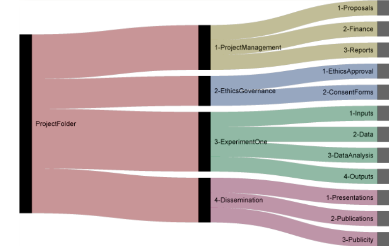
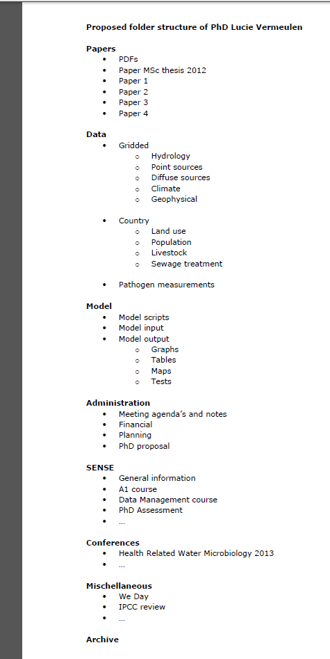
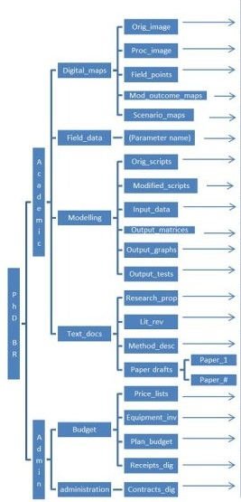
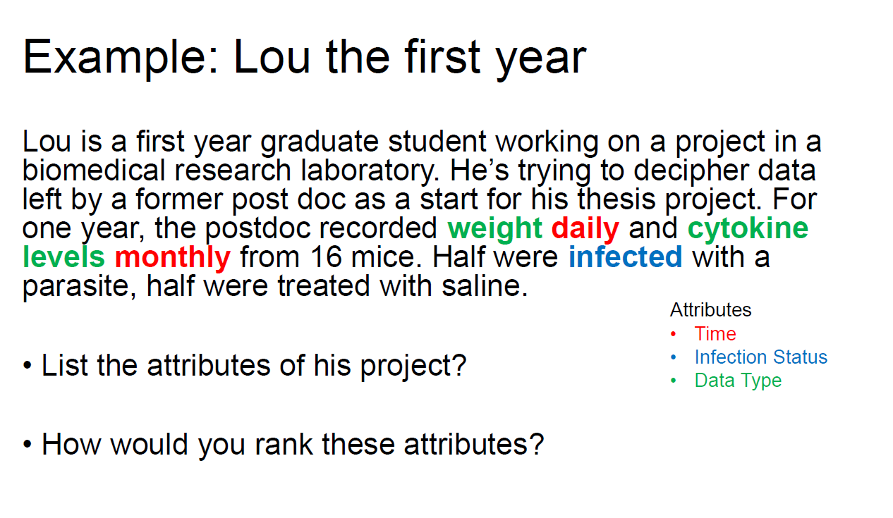
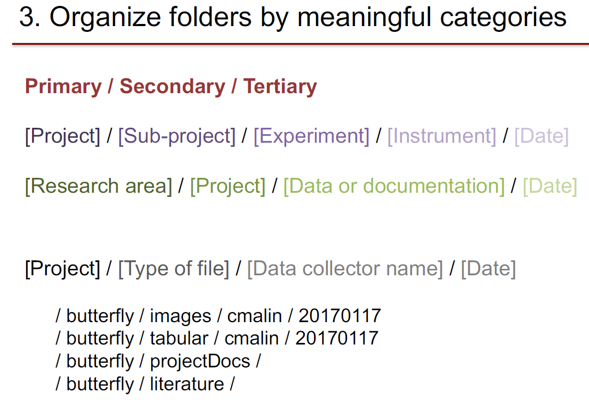

# Organiser niveau 1/2 : structurer
## Classer / caractériser : dossiers / mots clé
On peut distinguer 2 modes de structure :

* hiérarchique, par dossier et sous-dossier,
* fondée sur des mots clé,

présentant chacun des avantages et des inconvénients, que nous traduisons dans le tableau récapitulatif ci-dessous.

Type d'organisation | Avantages | Inconvénients
--- |--- |---|
| Organisation hiérarchique | D'un usage familier et largement répandu.  Représente bien la structure de l'information. Les items similaires sont stockés ensemble. Les sous-dossiers peuvent fonctionner comme des listes de tâches. | Etonnament difficile à mettre en place. Equilibre entre largeur et profondeur difficile à trouver. Chaque item ne peut avoir qu'une seule place. Si la hiérarchie ne convient plus, la réorganisation est chronophage.
| Organisation par mots clé  | Les items peuvent avoir plusieurs places. Peut être plus rapide et plus facile à mettre en place. Dans un contexte collaboratif, un tel système peut être plus facile à combiner. | Les fichiers ne sont pas stockés de cette façon. Si l'item ne se voit pas assigner un mot clé correctement au départ, il peut être difficile de le retrouver. Risque accru d'incohérence. Représente moins bien la structure de l'information.

Voir : Malinowski, C. (2017, 18 janvier). Data Management: File Organization. MIT Libraries. Repéré à https://libraries.mit.edu/data-management/files/2014/05/FileOrgSlides_20170118sm.pdf

Ces 2 systèmes peuvent se compléter (et se combiner) :
* l'organisation hiérarchique permet de **classer** et de ranger mais impose de **choisir**,
* les mots clé permettent de **caractériser** (et d'intégrer ces caractéristiques avec les items si les mots clé sont saisis sous forme de métadonnées incorporées aux fichiers).

Le MIT propose un guide détaillé comportant notamment une sélection de ressources, voir :

Smith, K. & Malinowski, C. (n.d.). Tagging and Finding Your Files. _MIT Libraries_. Repéré à https://libguides.mit.edu/c.php?g=176344&p=1160756

### Exemples données bibliographiques avec Zotero
Pour certaines données, les données bibliographiques gérées dans un logiciel de gestion bibliographique par exemple, une organisation par mots clé peut être facilement (et efficacement) paramétrée, voir :

Flamerie, F. (2015, 7 décembre). Comment organiser sa bibliothèque ? [Billet]. _Le blog Zotero francophone_. Repéré à https://zotero.hypotheses.org/756

Voici quelques exemples de démarche d'organisation utilisant Zotero.

Gruson-Daniel, C. (2016, novembre). Atelier #05 : La biblio, c’est fantastique ! : découverte de Zotero. _HackYourPhd [GitHub]_. Repéré à https://github.com/HackYourPhd/ateliers-open-geek/blob/master/Atelier_05_biblio_zotero/Atelier_05.md

Martinolli, P. (2016, 11 octobre). ZotLog : structurer son parcours de recherche avec Zotero  [Billet]. _Tribune Compétences Informationnelles_. Repéré à https://tribuneci.wordpress.com/2016/10/11/zotlog-structurer-son-parcours-de-recherche-avec-zotero/

Muller, C. (2018, 4 mars). Cinq ans d’usage de Zotero, un bilan [Billet]. _Acquis de conscience_. Repéré à https://consciences.hypotheses.org/1184

Aujourd'hui nous allons surtout considérer l'organisation hiérarchique, par dossier.

## Structures de dossiers : exemples

**Exemple structure de dossiers 1**

Source : Vukovic, N. (n.d.). Setting up an Organised Folder Structure for Research Projects. _Nikola_. Repéré à http://nikola.me/folder_structure.html

**Exemple structure de dossiers 2**

Source : Vermeulen, L. C. (n.d.). Data Management Plan. Repéré à https://www.wur.nl/upload_mm/d/4/9/fec82c96-d901-49c2-8205-c40a2e819ee7_Data_Management_Plan_Lucie_Vermeulen.pdf

Dans le même document, voir aussi le tableau des fichiers

**Exemple structure de dossiers 3**

Source : Wageningen University & Research. (2015, 9 février). Organising files and folders. _Wageningen University & Research_. Repéré à https://www.wur.nl/en/Expertise-Services/Data-Management-Support-Hub/Browse-by-Subject/Organising-files-and-folders.htm

## Principes pour définir une structure de dossiers
Nous proposons de définir la démarche suivante.

1. Etape 1 : caractériser
2. Etape 2 : inventorier et grouper
3. Etape 3 : structurer et nommer

Adapté de :

Magle, C. T. (2016). Data and Donuts: Data organization. Repéré à https://www.slideshare.net/CTobinMagle/data-and-donuts-data-organization

Malinowski, C. (2017, 18 janvier). Data Management: File Organization. MIT Libraries. Repéré à https://libraries.mit.edu/data-management/files/2014/05/FileOrgSlides_20170118sm.pdf

### Etape 1 : caractériser
Identifier les principales caractéristiques de votre projet vous permettra d'identifier comment répartir vos données en différentes catégories, ou attributs.
L'organisation de premier niveau est l'attribut le plus important.

### Etape 2 : inventorier et grouper
A partir de la liste des types de données et de fichiers, il s'agit ensuite de déterminer et hiérarchiser les critères pertinents pour les regrouper. Ces critères varient d'une personne à l'autre, d'un projet à l'autre, d'un contexte à l'autre.

Exemples de critère :

* localisation,
* date,
* type de fichier,
* type de donnée,
* étape d'un processus,
* méthode,
* sujet.

**Exemple structure de dossiers 4**

Source : Magle, C. T. (2016). Data and Donuts: Data organization. Repéré à https://www.slideshare.net/CTobinMagle/data-and-donuts-data-organization

**Exemple structure de dossiers 5**

Source : Malinowski, C. (2017, 18 janvier). Data Management: File Organization. MIT Libraries. Repéré à https://libraries.mit.edu/data-management/files/2014/05/FileOrgSlides_20170118sm.pdf

**Exemple structure de dossiers 6**

Source : Noble, W. S. (2009). A Quick Guide to Organizing Computational Biology Projects. _PLoS Computational Biology_, _5_(7), e1000424. https://doi.org/10.1371/journal.pcbi.1000424

Cet exemple combine des critères logiques et chronologiques.

>Within a given project, I use a top-level organization that is logical, with chronological organization at the next level, and logical organization below that. A sample project, called msms, is shown in Figure 1. At the root of most of my projects, I have a data directory for storing fixed data sets, a results directory for tracking computational experiments peformed on that data, a doc directory with one subdirectory per manuscript, and directories such as src for source code and bin for compiled binaries or scripts.

Source : Noble, W. S. (2009). A Quick Guide to Organizing Computational Biology Projects. _PLoS Computational Biology_, _5_(7), e1000424. https://doi.org/10.1371/journal.pcbi.1000424

### Etape 3 : structurer et nommer
Il s'agit maintenant de traduire les éléments d'organisation définis aux étapes 1 et 2 dans une structure de dossiers.

Rappel des objectifs :

* permettre aux utilisateurs de retrouver facilement les données [utilisateurs = vous aujourd'hui, vous dans 5 ou 10 ans, vos collègues, autres?],
* éviter la duplication des fichiers.

#### Bonnes pratiques pour la définition d'une arborescence

* Vérifiez s'il existe des conventions ou procédures propres à votre discipline ou votre structure.
* Trouvez (du moins cherchez) un équilibre entre la profondeur et la largeur (cf. _supra_) : ne créez pas trop de sous-sous-sous-dossier, qui sont peu accessibles.
* S'ils sont hétérogènes, ne pas dépasser un nombre raisonnable de fichiers par dossier contribuera à rendre chacun de vos dossiers plus manipulable et navigable.
* Commencez avec un nombre limité de dossiers et créez ensuite les dossiers plus spécifiques.
* Déplacez les fichiers sur lesquels vous ne travaillez plus à un emplacement différent, dans un dossier OLD ou ARCHIVES par exemple.
* Evitez les catégories qui se chevauchent.

| A éviter | A privilégier |
|: - | : -
| Manuscript/Data   Presentations/Data  ProgressReports/Data| Data PrésentationData RawData

Traduit et adapté de : Malinowski, C. (2017, 18 janvier). Data Management: File Organization. MIT Libraries. Repéré à https://libraries.mit.edu/data-management/files/2014/05/FileOrgSlides_20170118sm.pdf

#### Bonnes pratiques pour le nommage des dossiers
* Conservez des noms brefs et significatifs.
* Si vous incluez des numéros, assurez-vous d'utiliser au moins 2 nombres, _i. e._ 01, 02, etc. plutôt que 1, 2, etc.
* Bannissez les caractères spéciaux et accentués.
* Remplacez les espaces par des délimiteurs.
* Utilisez des délimiteurs de façon déterminée et cohérente. Plusieurs options sont possibles :

  * le `-`,
  * le `_`,
  * le système dit `CamelCase`.

Les recommandations concernant ces différents systèmes peuvent varier ; il s'agit avant tout de préférences personnelles.
NB la casse n'est pas prise en compte dans tous les systèmes, aussi faut-il considérer que `MyFile` et  `myfile` sont équivalents ; la majuscule n'est pas discriminante.

En résumé :
>Be Clear, Concise, Consistent, Correct, Conformant

Source citation : Malinowski, C. (2017, 18 janvier). Data Management: File Organization. MIT Libraries. Repéré à https://libraries.mit.edu/data-management/files/2014/05/FileOrgSlides_20170118sm.pdf

##### Ressources utilisées

Magle, C. T. (2016). Data and Donuts: Data organization. Repéré à https://www.slideshare.net/CTobinMagle/data-and-donuts-data-organization

Malinowski, C. (2017, 18 janvier). Data Management: File Organization. MIT Libraries. Repéré à https://libraries.mit.edu/data-management/files/2014/05/FileOrgSlides_20170118sm.pdf

University of Leicester. (n.d.). Naming files and folders. _University of Leicester_. Repéré à https://www2.le.ac.uk/services/research-data/organise-data/naming-files

Wageningen University & Research. (2015, 9 février). Organising files and folders. _Wageningen University & Research_. Repéré à https://www.wur.nl/en/Expertise-Services/Data-Management-Support-Hub/Browse-by-Subject/Organising-files-and-folders.htm

### 2 exemples supplémentaires de démarche de structuration de dossiers

* Sciences humaines : leçon _Programming historian_

Baker, J. (2014). Preserving Your Research Data. _Programming Historian_. Repéré à https://programminghistorian.org/lessons/preserving-your-research-data

* Informatique

Wallis, T. (2014, 16 janvier). Setting up a project directory. _Practical Vision Science_. Repéré à https://tomwallis.info/2014/01/16/setting-up-a-project-directory/

### Automatiser : structure et inventaire
#### Inventaire
Pour vous aider dans cette tâche, [Q-Dir](https://www.softwareok.com/?seite=Freeware/Q-Dir) permet d'exporter sous la forme d'un fichier .csv le contenu d'un dossier.
* Un clic-droit sur les colonnes permet de sélectionner les colonnes à afficher.
* Le menu `Fichier > Exporter` permet de lancer l'export.

#### Créer des dossiers à partir d'un fichier.txt
[Text 2 Folders](http://www.dcmembers.com/skwire/download/text-2-folders/) permet de créer très rapidement des dossiers à partir d'un fichier .txt.
