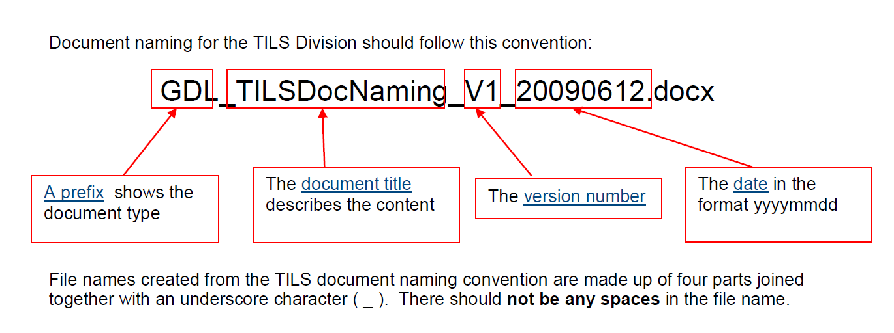
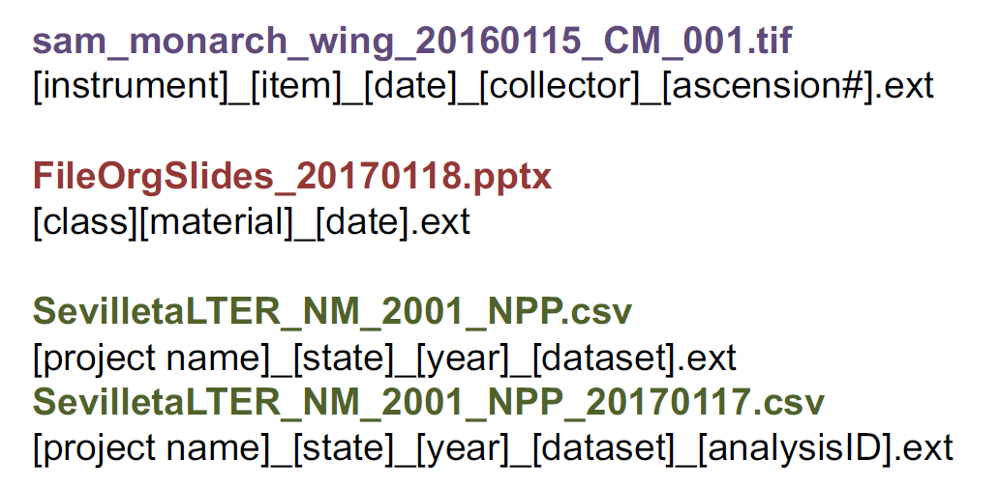

# Organiser niveau 2 : nommer

## Pourquoi (bien) nommer (les fichiers)?
* Les fichiers peuvent être distingués les uns des autres au sein du dossier dans lequel ils sont classés, et indépendamment de ce dossier.
* Il est plus facile de localiser les fichiers et de naviguer entre eux.
* Les fichiers peuvent être retrouvés non seulement par leur créateur mais également par d'autres utilisateurs.
* Les fichiers peuvent être triés selon un ordre logique.
* Les fichiers ne sont pas accidentellement écrasés ou supprimés.
* Les différentes versions des fichiers peuvent être identifiées.
* Si les fichiers sont déplacés sur une autre plateforme de stockage, leur nom va conserver des informations de contexte utiles.
* Un nommage correct évite la confusion lorsque plusieurs personnes travaillent sur des fichiers partagés.
* Un nomage correct facilite l'envoi du lien vers un fichier plutôt que l'envoi du fichier lui-même.

Traduit et adapté de :
The University of Edinburgh. (n.d.). Organising data. _MANTRA Research Data Management Training_. Repéré à http://mantra.edina.ac.uk/organisingdata/

Division of Technology, Information and Library Services - Queensland University of Technology. (2015). TILS Document Naming Convention. _Queensland University of Technology_. Repéré à https://www.library.qut.edu.au/about/management/documents/QUTTILSDocNamingConvention.pdf

## Nommage des fichiers : exemples

**Exemple nommage des fichiers 1 (suite exemple 3 dossiers)**

Source : Wageningen University &amp; Research. (2015, 9 février). Organising files and folders. _Wageningen University &amp; Research_. Repéré à https://www.wur.nl/en/Expertise-Services/Data-Management-Support-Hub/Browse-by-Subject/Organising-files-and-folders.htm

**Exemple nommage des fichiers 2**

Le document de TILS (Université du Queensland) comporte une documentation (listes des préfixes, etc.) du schéma de nommage.

Source : Division of Technology, Information and Library Services - Queensland University of Technology. (2015). TILS Document Naming Convention. _Queensland University of Technology_. Repéré à https://www.library.qut.edu.au/about/management/documents/QUTTILSDocNamingConvention.pdf

**Exemple nommage des fichiers 3**

Source : Malinowski, C. (2017, 18 janvier). Data Management: File Organization. MIT Libraries. Repéré à https://libraries.mit.edu/data-management/files/2014/05/FileOrgSlides_20170118sm.pdf

## Principes et bonnes pratiques pour nommer les fichiers

Toutes les bonnes pratiques définies pour les dossiers s'appliquent également aux fichiers. Ce qui suit s'ajoute donc à ce qui précède.

**Principe clé : vos noms de fichier doivent être lisibles et utilisables par des humains ET des machines**.

Vous vous en assurerez en définissant des noms :
* descriptifs,
* spécifiques,
* composés de segments allant du plus général au plus spécifique,
* brefs (pas plus de 30 carctères, de préférence moins),
* exempts d'abréviations (ou du moins d'abréviations non documentées et d'un usage non général),
* exempts d'autres `.` que celui précédant l'extension de fichier,
* cohérents.

**Descriptif** = inclure des éléments tels qu'un identifiant, le nom du projet, la date, la version, etc.

**Spécifique** = non générique, afin que des fichiers d'un même projet (ou de projets différents) ne puissent pas être confondus

**Cohérent** = conserver
* tous les éléments,
* sous la même forme : par exemple pour une date ne pas indiquer tantôt YYYYMM, tantôt YYMM ou encore YYMMDD.

On peut garder le même résumé que pour les noms de dossier :
>Be Clear, Concise, Consistent, Correct, Conformant

Source : Malinowski, C. (2017, 18 janvier). Data Management: File Organization. MIT Libraries. Repéré à https://libraries.mit.edu/data-management/files/2014/05/FileOrgSlides_20170118sm.pdf

Traduit et adapté de :
Magle, C. T. (2016). Data and Donuts: Data organization. Repéré à https://www.slideshare.net/CTobinMagle/data-and-donuts-data-organization

Malinowski, C. (2017, 18 janvier). Data Management: File Organization. MIT Libraries. Repéré à https://libraries.mit.edu/data-management/files/2014/05/FileOrgSlides_20170118sm.pdf

## Une étude de cas : traitement des images

Hodge, A. & Stanford Libraries. (2015). Case study: File naming done well. _Stanford Libraries_. Repéré à http://library.stanford.edu/research/data-management-services/case-studies/case-study-file-naming-done-well

Les bibliothèques de Stanford détaille dans cette étude de cas un schéma de nommage défini pour des images.

Il va nous intéresser pour la suite, car les images font partie des objets souvent collectés par lot, et pour lesquels un renommage manuel serait fastidieux et chronophage.

## Automatiser : nommage par lot

###  Logiciels de renommage par lot
**Windows** :

* [Ant Renamer](www.antp.be/software/renamer)
* [RenameIT](sourceforge.net/prpjects/renameit)
* [Bulk Rename Utility](www.bulkrenameutility.co.uk/)

**Mac** :
* [Renamer 5](renamer.com/)
* [Name Changer](mrrsoftware.com/namechanger/)

**Linux** :
* [GNOME Commander](www.nongnu.org/gcmd/)
* [GPRename](http://gprename.sourceforge.net/)

**Unix** :
The use of the grep command to search for regular expressions

Source : The University of Edinburgh. (n.d.). Organising data. _MANTRA Research Data Management Training_. Repéré à http://mantra.edina.ac.uk/organisingdata/
