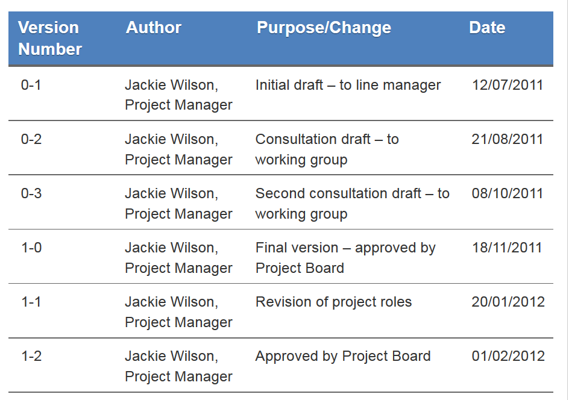

# Organiser niveau 2 : versionner
## Versionner : anecdotes

**Anecdote versionner 1**

Source : Cham, J. (n.d.). _A story in file names_. Repéré à http://phdcomics.com/comics/archive.php?comicid=1323

**Anecdote versionner 2**

Source : Cham, J. (2012). _notFinal.doc_. Repéré à http://phdcomics.com/comics/archive.php?comicid=1531

## Principes et bonnes pratiques de versionnage

Il s'agit de :

* **distinguer les différentes versions** des fichiers de façon cohérente,
* identifier le **statut** de chaque version,
* comprendre (ou du moins identifier) les **modifications** effectuées entre plusieurs versions,
* définir par là-même une politique de versionnage.

Les bénéfices attendus s'expriment en termes de :
* traçabilité,
* identification,
* clarté,
* duplication réduite,
* erreurs réduites.

Traduit et adapté de : University of Leicester. (n.d.). Version control. _University of Leicester_. Repéré à https://www2.le.ac.uk/services/research-data/organise-data/version-control

NB Cette stratégie de contrôle de versions sera notamment influencée par les facteurs suivants :

* nombre d'utilisateurs des fichiers,
* localisation simple ou multiple des fichiers,
* nécessité de synchroniser les versions entre les utilisateurs ou les localisations.

Traduit et adapté de : UK Data Service. (n.d.). Version control and authenticity. _UK Data Service_. Repéré à https://www.ukdataservice.ac.uk/manage-data/format/versioning

### Distinguer les versions

Un moyen classique est de recourir à une numérotation, intégrant le cas échéant une décimale.

Le nombre ordinal distingue les changements **majeurs**, _i. e._ un changement majeur occasionne le passage de la **v01** à la **v02**.

La décimale est utilisée pour les changements **mineurs**, _i. e._ on passe de la **v01-07** à la **v01-08** en cas de modification mineure.

### Premiers éléments d'une stratégie de contrôle de versions

* Déterminer combien de versions d'un fichier conserver, quelles versions conserver, pour combien de temps, et comment les organiser.
* Expliciter si nécessaire les **critères** de changement de version : que considérer comme un changement majeur ? comme un changement mineur ?
* Les versions _master_ des données, identifiées en tant que telles, sont toujours conservées. Afin de se prémunir d'une modification ou d'une suppression éventuelle de ces fichiers, une bonne pratique peut être d'en interdire la modification, en créant une version "lecture seule du fichier".

Rappel : Windows : `clic-droit > Propriétés > Sécurité`.

* Interdire la modification des versions définitives peut aussi permettre de se prémunir de fâcheux accidents.
* Identifier les versions "jalons" (_milestone versions_) à conserver.
* Les versions intermédiaires pourront être supprimées.
* Identifier une localisation unique pour le stockage des versions _master_ et "jalons".

Traduit et adapté de : UK Data Service. (n.d.). Version control and authenticity. _UK Data Service_. Repéré à https://www.ukdataservice.ac.uk/manage-data/format/versioning

>Why should you discard or delete obsolete versions of data files?
>Too many similar or related files may be confusing, both to yourself and to anyone else wanting to access or use your data. You may think that you know which data file is which but that may not always be the case as time passes and the number of different file versions increase. It is easier to maintain a manageable number of versions with a clear naming structure. As long as the original 'raw' or definitive copy is retained and processing is well documented, the intermediate working files can and should be discarded.

Source : The University of Edinburgh. (n.d.). Organising data. _MANTRA Research Data Management Training_. Repéré à http://mantra.edina.ac.uk/organisingdata/

### Comment faire?
Exemples de contrôle de version intégré au nom de fichier, sous la forme [nom_du_document][numéro_de_version][statut]:

* Smith_interview_July2010_V1_DRAFT
* Lipid-analysis-rate-V2_definitive
* 2001_01_28_ILB_CS3_V6_AB_edited

Source : The University of Edinburgh. (n.d.). Organising data. _MANTRA Research Data Management Training_. Repéré à http://mantra.edina.ac.uk/organisingdata/

### Identifier les modifications entre plusieurs versions
Si le modèle de nommage présenté _supra_ permet d'atteindre les 2 premiers objectifs,_i. e._ distinguer les versions et identifier les versions, il est insuffisant pour identifier pourquoi on est passé d'une version à l'autre.

Comment documenter un changement de version? Fond et forme?

La méthode la plus simple est de tenir à jour un tableau (intégré au fichier auquel il s'applique ou créé en tant que fichier distinct), contenant au moins les informations suivantes :
* le numéro de version,
* le nom de la personne qui a effectué le changement,
* l'objet de la modification ou la modification elle-même,
* la date de la modification.

**Exemple versionnage des fichiers 1 : versionnage seul**

Source : University of Leicester. (n.d.). Version control. _University of Leicester_. Repéré à https://www2.le.ac.uk/services/research-data/organise-data/version-control

**Exemple versionnage des fichiers 2 : versionnage + métadonnées**

Source : UK Data Service. (n.d.). Version control and authenticity. _UK Data Service_. Repéré à https://www.ukdataservice.ac.uk/manage-data/format/versioning

## Automatiser
Les modes de fonctionnement que nous avons vu pour le moment sont très rudimentaires et manuels. S'ils peuvent éventuellement suffire pour un nombre restreint de fichiers d'un seul utilisateur, ils peuvent s'avérer largement inefficaces dès lors que :

* vous manipulez de nombreux fichiers,
* avec d'autres utilisateurs,
* éventuellement sur des sites distants.

Il convient alors d'utiliser une application ou un service permettant de gérer automatiquement le contrôle de version.

L'un des systèmes les plus performants pour ce faire est Git, sur lequel sont fondés des services en ligne tels que GitHub, GitLab, Framagit, Bitbucket, etc.

Si ce système a d'abord été conçu pour le code informatique, il peut être appliqué avec profit à des projets de toute nature, comme le code civil français.

Voir : Morin, S. (2015). france.code-civil: Le code civil français sous git. Repéré à https://github.com/steeve/france.code-civil

Les bénéfices de Git/GitHub sont détaillés de façon synthétique par J. Oliver, citons les principaux items :

* reproducibilité,
* copie en ligne (et non sauvegarde si vous utilisez un service tiers tel que GitHub),
* partage,
* documentation.

Voir : Oliver, J. (2017, 25 octobre). My Favourite Tool: Git/GitHub. _Software Carpentry_. Repéré à http://software-carpentry.org//blog/2017/10/oliver-fave.html

**Quelques ressources pour se familiariser avec la logique d'entrepôt et GitHub**

* Exemple d'entrepôt avec des exercices pratiques, autour de l'organisation d'un pot

Coates, H. (2017, 21 avril). project-mgmt: Repository created to provide resources for learning to use GitHub for project management. Repéré à https://github.com/coateshl/project-mgmt (Ouvrage original publié en 21 avril 2017).

* Leçon du site _Programming historian_

Strien, D. van. (2016, 17 juin). An Introduction to Version Control Using GitHub Desktop. _Programming Historian_. Repéré à https://programminghistorian.org/lessons/getting-started-with-github-desktop

* Exemple d'une démarche complète _Version control_ en 2 parties

Wallis, T. (2014, 5 février). Version control Part 1: Local repository. _Practical Vision Science_. Repéré à https://tomwallis.info/2014/02/05/version-control-part-1-local-repository/
Wallis, T. (2014, 27 février). Version control Part 2: Remote repository. _Practical Vision Science_. Repéré à https://tomwallis.info/2014/02/27/version-control-part-2-remote-repository/

NB Prenez bien en considération les **conditions d'utilisation** des services en ligne tiers que vous utilisez, et assurez-vous qu'elles correspondent bien aux exigences liées à votre projet ou aux règles de fonctionnement de votre structure. On détaillera _infra_ quand on évoquera la sauvegarde.

* La version gratuite de GitHub ne permet ainsi pas de créer d'entrepôt privé ; la taille limite d'un entrepôt est de 1Go.
* Si vous souhaitez privilégier des outils entièrement _open source_ Framagit ou GitLab seront plus adaptés que GitHub.

Le contrôle de version est intégré dans **[Open Science Framework](https://osf.io/)**.

* Recension de Open Science Framework avec des études de cas. NB cette recension est déjà un peu datée, car de nouvelles fonctionnalités sont très régulièrement et rapidement ajoutées.

Foster, E. D. & Deardorff, A. (2017). Open Science Framework (OSF). _Journal of the Medical Library Association : JMLA_, _105_(2), 203‑206. https://doi.org/10.5195/jmla.2017.88

* Présentation de Open Science Framework avec des exemples de différents types de projet p. 12 et suivantes.

Magle, C. T. (2016). Data and Donuts: Data organization. Repéré à https://www.slideshare.net/CTobinMagle/data-and-donuts-data-organization

### Quelques logiciels pour gérer automatiquement le contrôle de versions
* [Git](https://git-scm.com/)
* [Subversion](https://subversion.apache.org/)
* [Mercurial](https://www.mercurial-scm.org/)
* [Methodicate](https://www.methodicate.com/) : spécifiquement créé pour la recherche : voir page d'accueil du site  :
> Methodicate is being developed by researchers from the University of Oxford and RWTH Aachen University.
