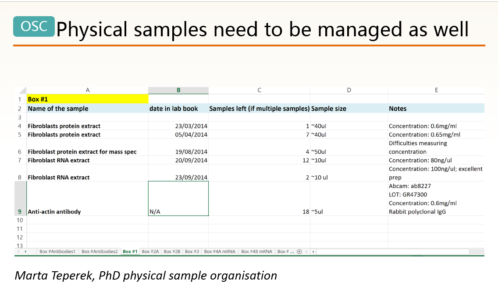
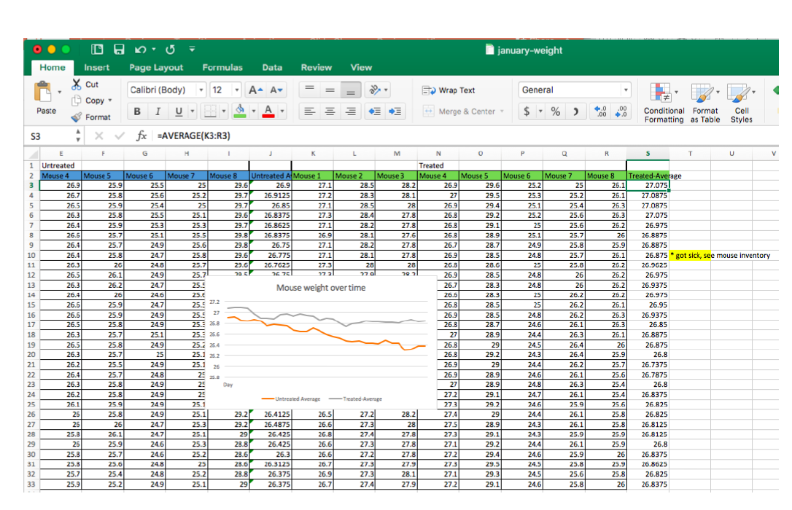

# Organiser niveau 3 : les items/ les variables

Nous arrivons au niveau le plus fin de donnée, celui de l'item, de la variable.

## Les items physiques

Exemple : les échantillons de laboratoire.

Source : Higman, R. & Teperek, M. (2017, 11 janvier). Template Research Data Management Workshop For Stem Researchers. https://doi.org/10.5281/zenodo.239090

## Un préalable : _tidy data_

### _Tidy data_ , partons d'un exemple

Source : Magle, C. T. (2016). Data and Donuts: Data organization. Repéré à https://www.slideshare.net/CTobinMagle/data-and-donuts-data-organization

Cette feuille Excel ressemble-t-elle à celles que vous créez/manipulez/récupérez de vos collègues?

#### Lorsque vous utilisez Excel, recourez-vous à l'une des pratiques suivantes?

  1. Codes couleur
  2. Fonction "format de cellule" (fusionner des cellules, mise en forme, format de nombre, etc.)
  3. Notes
  4. Formules de calcul
  5. Graphiques

Vous semblent-elles problématiques? Pourquoi?

  1. Codes couleur = non lisibles par un ordinateur (la compréhensibilité par les humains est également limitée... )/ ajoutez plutôt une colonne pour reporter l'information qu'est censée indiquer la couleur
  2. Fonction "format de cellule" = non lisible informatiquement + peut conduire à des erreurs.

> The spreadsheet software Microsoft Excel, when used with default settings, is known to convert gene names to dates and floating-point numbers. A programmatic scan of leading genomics journals reveals that approximately one-fifth of papers with supplementary Excel gene lists contain erroneous gene name conversions.
>...
> For example, gene symbols such as SEPT2 (Septin 2) and MARCH1 [Membrane-Associated Ring Finger (C3HC4) 1, E3 Ubiquitin Protein Ligase] are converted by default to ‘2-Sep’ and ‘1-Mar’, respectively.

Source : Ziemann, M., Eren, Y., & El-Osta, A. (2016). Gene name errors are widespread in the scientific literature. _Genome Biology_, _17_, 177. https://doi.org/10.1186/s13059-016-1044-7

   3. Notes = non lisibles par un ordinateur + mélange données et métadonnées
   4. Formules de calcul = à bannir des fichiers de données _master_
>If you are doing calculations in your data file, that likely means you are regularly opening it and typing into it. Doing so incurs some risk that you will accidentally type junk into your data.

Source : Broman, K. W. & Woo, K. H. (2017). Data organization in spreadsheets. _PeerJ Preprints_, _5_, e3183v1. https://doi.org/10.7287/peerj.preprints.3183v1

   5. Graphiques = ne sont pas exportables + à bannir de fichiers de données _master_ au même titre que les formules de calcul

Traduit et adapté de : Magle, C. T. (2016). Data and Donuts: Data organization. Repéré à https://www.slideshare.net/CTobinMagle/data-and-donuts-data-organization

### Bonnes pratiques pour les données tabulaires

#### Organisation générale
* 1 feuille/classeur
* 1 table/feuille
* 1 colonne = 1 variable
* 1 ligne = 1 observation
* 1 cellule = 1 information
* pas de ligne vide
* pas de colonne vide
* Ne mélangez pas les notes et les données
* Enregistrez les métadonnées dans un simple fichier texte à part = par exemple fichier `readme`
* N'oubliez pas de renseigner à la fois les codes et valeurs qui vous sont propres ET les standards utilisés pour les codes et valeurs normalisés dans un `dictionnaire de données`, aussi appelé `codebook`.

#### En-têtes de colonnes = noms de variables
* Utilisez des noms descriptifs - ni trop longs ni trop courts.
* Harmonisez si possible et applicable les noms de variables communes (à plusieurs fichiers, à plusieurs projets).
* Incluez si possible et applicable l'unité de mesure.
* Evitez les espaces, les nombres (en début de chaîne de caractère) et les caractères spéciaux.
* Pour les dates, considérez de saisir dans des colonnes séparées l'année, le mois, le jour, etc.
* Utilisez les abréviations les plus communément utilisées - par exemple `temp` pour température, `lat` pour latitude.

#### Données
* Enregistrez les zéros en tant que zéros.
* Utilisez une valeur appropriée pour enregistrer des données manquantes : un `blanc`,  un `-` ou `NA` peut être approprié ; les recommandations peuvent varier.
* Utilisez si possible des valeurs standardisées .
* Evitez les caractères spéciaux.
* Evitez les virgules. Elles peuvent notamment être interprétés comme un délimiteur lors d'un export .csv ; si elles servent à délimiter 2 informations (ville, état par exemple), créez 2 colonnes, ce qui revient à "1 cellule = 1 information".
* Considérez l'utilisation de la fonction `Validation des données` dans Excel.

Traduit et adapté de :

Arnould, P.-Y. & Jacquemot-Perbal, M.-C. (2017). _Guide de bonnes pratiques : gestion et valorisation des données de recherche_ (Rapport No. v1.1). OTELo. https://doi.org/10.24396/ORDAR-1

Bahlai, C. & Pawlik, A. (2017, avril). Data Organization in Spreadsheets: Formatting problems. _Data Carpentry_. Repéré à http://www.datacarpentry.org/spreadsheet-ecology-lesson/02-common-mistakes/

Cornell Research Data Management Service Group. (n.d.). Preparing tabular data for description and archiving. _Research Data Management Service Group_. Repéré à https://data.research.cornell.edu/content/tabular-data

Della Vedova, C. (2017, 17 décembre). 12 conseils pour organiser efficacement vos données dans un tableur. _Statistiques et logiciel R_. Repéré à https://statistique-et-logiciel-r.com/12-recommandations-pour-organiser-efficacement-vos-donnees-dans-un-tableur/

Hodge, A. (n.d.). Case study: Spreadsheets. _Stanford Libraries_. Repéré à http://library.stanford.edu/research/data-management-services/case-studies/case-study-spreadsheets

Magle, C. T. (2016). Data and Donuts: Data organization. Repéré à https://www.slideshare.net/CTobinMagle/data-and-donuts-data-organization

### Ressources complémentaires pour les données tabulaires
* Leçon _Data Carpentry_

Bahlai, C. & Teal, T. (Éds). (2017). Data Carpentry: Data Organization in Spreadsheets Ecology lesson. _Version 2017.04.0_. Repéré à http://www.datacarpentry.org/spreadsheet-ecology-lesson/

* Tutoriel détaillé de K. Broman

Broman, K. W. (n.d.). data organization : organizing data in spreadsheets. Repéré à http://kbroman.org/dataorg/

* Un outil pour vos fichiers Excel (non testé) ?

McGrory, J. (2015). Poster for « Excel Archival Tool: Automating the Spreadsheet Conversion Process ». Repéré à http://conservancy.umn.edu/handle/11299/171966

* Un exemple de traitement de données tabulaires (notamment dates et noms géographiques) en SHS

Middle, S. (2017, 21 décembre). Cleaning and Visualising Privy Council Appeals Data. _Digital scholarship blog_. Repéré à http://blogs.bl.uk/digital-scholarship/2017/12/cleaning-and-visualising-privy-council-appeals-data.html

## Dictionnaire de données - codebook
Quelles informations inclure dans un dictionnaire de données?

* Le nom exact de la variable tel qu'il figure dans le fichier de données.
* Une version du nom de la variable qui pourrait être utilisée dans des visualisations des données.
* Une explicitation de ce que la variable signifie.
* L'unité de mesure.
* Les valeurs minimum et maximum attendues.
* Les valeurs autorisées si applicable.

Traduit et adapté de : Broman, K. W. & Woo, K. H. (2017). Data organization in spreadsheets. _PeerJ Preprints_, _5_, e3183v1. https://doi.org/10.7287/peerj.preprints.3183v1

* Sciences : exemple et recommandations : p. 14 et suivantes de
Arnould, P.-Y. & Jacquemot-Perbal, M.-C. (2017). _Guide de bonnes pratiques : gestion et valorisation des données de recherche_ (Rapport No. v1.1). OTELo. https://doi.org/10.24396/ORDAR-1

* Sciences humaines : exemple : point 7 de
Simonsohn, U. (2018, 6 février). [69] Eight things I do to make my open research more findable and understandable. _Data Colada_. Repéré à http://datacolada.org/69
