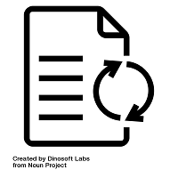
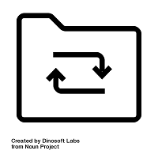
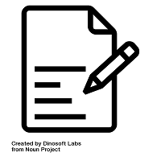
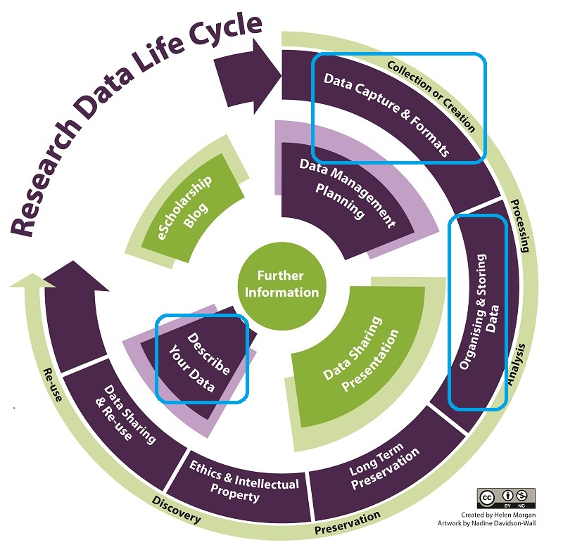

<!-- $theme: default-->
<!-- page_number: true -->
<!-- $size: 16:9 -->

# Organiser efficacement ses données
# Trame
**Urfist Bordeaux**
23 mars 2018
Matériel du cours en ligne [ici](https://github.com/fflamerie/organisation_donnees_2018)
<small>
*Frédérique Flamerie*
*chargée de mission science ouverte/données de la recherche*
*Université de Bordeaux - Direction de la Documentation*
</small>


---

# Rappel des objectifs
1. Optimiser sa stratégie et ses pratiques de gestion de données
2. Réaliser un autodiagnostic de ses pratiques de gestion de données
3. Organiser d’importants volumes de documentation numérique : documents collectés, documents produits


---


# Tour de table
1. Qui êtes-vous?
2. De quel laboratoire venez-vous?
3. Quels types de recherche effectuez-vous?
4. Pourquoi êtes-vous ici aujourd'hui?

---

# Programme
Théâtre : Molière  _Le Bourgeois gentilhomme_
Poésie : Rimbaud "Je est un autre"
Des outils
Des fiches thématiques
Beaucoup d'exemples
Analyse de vos méthodes actuelles et premières réflexions d'amélioration
Des questions avec  @ **https://huit.re/org_donnees_questions**

## Et à un moment : pause :coffee: ou :tea: ou :tropical_drink:

---
# Organiser?


Quelles tâches associez-vous à l'organisation? Organiser = ?

---
# Organiser
## Structurer
## Nommer
## Versionner
# Documenter
# Caractériser

  


---
# Organiser - documenter - caractériser

  

---

## Pourquoi?
* S'aider soi-même et
* aider les autres à **comprendre** et **réutiliser** les données.
* NB **soi-même dans qqs années = 1 autre**.
* Définir des règles = imposer des contraintes ou éviter de se demander (et se demander à nouveau 3 semaines après, et se demander encore des mois plus tard) comment faire?
* Documenter = nécessaire (mais non suffisant) pour assurer un minimum de reproductibilité, et démontrer son honnêteté intellectuelle et scientifique : enjeux de **traçabilité** et d'**intégrité**.


Encore plus de bénéfices : University of Leicester. (n.d.). Organise data. _University of Leicester_. Repéré à https://www2.le.ac.uk/services/research-data/organise-data


---

Vous en êtes convaincus puisque vous êtes ici.

Pour convaincre vos collègues en 4 pages  : Markowetz, F. (2015). Five selfish reasons to work reproducibly. _Genome Biology_, _16_, 274. https://doi.org/10.1186/s13059-015-0850-7


>At the lowest level, working reproducibly just means avoiding beginners’ mistakes. Keep your project organized, name your files and directories in some informative way, store your data and code at a single backed-up location.

Et les 5 raisons :
>* Reason number 1: reproducibility helps to avoid disaster
>* Reason number 2: reproducibility makes it easier to write papers
>* Reason number 3: reproducibility helps reviewers see it your way
>* Reason number 4: reproducibility enables continuity of your work
>* Reason number 5: reproducibility helps to build your reputation

---

Les grands principes :
* investir un peu de temps en anticipant, pour ne pas en perdre beaucoup par la suite,
* établir un système rentable : en faire ni trop ni pas assez,
* établir un système efficace : trouver l'organisation qui fonctionne pour VOUS,
* et en fonction du contexte, une organisation qui convienne aussi à votre équipe, vos collègues, etc.


---
# Les outils


Que devrait accomplir un outil d'organisation idéal?


---
# Les outils de la formation
* org_donnees_tableau 
* bloc-notes Windows ou MarkdownPad
* Calc (LibreOffice)
* [Q-Dir](https://www.softwareok.com/?seite=Freeware/Q-Dir)
* [Text 2 Folders](http://www.dcmembers.com/skwire/download/text-2-folders/)
* [Ant Renamer](http://www.antp.be/software/renamer)

---

# org_donnees_tableau
Document en partie inspiré de : 
Malinowski, C. (2017, 18 janvier). Data Management: File Organization. MIT Libraries. Repéré à https://libraries.mit.edu/data-management/files/2014/05/FileOrgSlides_20170118sm.pdf


Il reprend les grandes étapes de l'organisation :

* structurer,
* nommer,
* versionner,

et toujours en toile/tâche de fond caractériser et documenter.

 

---

# org_donnees_tableau
Les 3 niveaux
<small>
>* Project level: what the study set out to do, how it contributes new knowledge to the field, what the research questions/hypotheses were, what methodologies were used, what sampling frames were used, what instruments and measures were used, etc. A complete academic thesis normally contains this information in detail, but a published article may not. If a dataset is shared, a detailed technical report will need to be included for the user to understand how the data were collected and processed. You should also provide a sample bibliographic citation to indicate how you would like secondary users of your data to cite it in any publications, etc.
>* File or database level: how all the files (or tables in a database) that make up the dataset relate to each other; what format they are in; whether they supercede or are superceded by previous files. A readme.txt file is the classic way of accounting for all the files and folders in a project.
>* Variable or item level: the key to understanding research results is knowing exactly how an object of analysis came about. Not just, for example, a variable name at the top of a spreadsheet file, but the full label explaining the meaning of that variable in terms of how it was operationalised.
</small>

<small>Source : The University of Edinburgh. (n.d.). Documentation, metadata, citation. _MANTRA Research Data Management Training_. Repéré à http://mantra.edina.ac.uk/documentation_metadata_citation/</small>

---
# Avant de commencer, un focus sur "nommer"


Quels sont les meilleurs noms de fichier?

---
# org_donnees_tableau

Complétez :
* pour les niveaux <mark>_Project_</mark> et <mark>_File_</mark>,
* les colonnes <mark>Caractériser</mark> et <mark>Organiser</mark>.

**Durée : 1h**
**Pause :coffee: ou :tea: ou :tropical_drink: incluse, quand vous voulez**

---
# org_donnees_tableau
Il nous manque 2 rubriques :
* la colonne <mark>Documenter</mark>,
* le niveau <mark>_Item-variable_</mark>.

---
# Documenter


Comment documentez-vous vos données? 
La question porte sur le **fond** (quelles informations créez-vous ou enregistrez-vous?) et sur la **forme** (où et comment enregistrez-vous ces données?) 


---

# Conclusion 1/2

Un résumé de cette formation en 7 brèves lessons (au moins les 6 premières) :

Cadwallader, L. (2016, 25 octobre). Walking the talk - reflections on working ‘openly’. _Unlocking Research_. Repéré à https://unlockingresearch.blog.lib.cam.ac.uk/?p=975

```
Lesson #1. Never touch your raw data files
Lesson #2. Record everything you do
Lesson #3. Date things. Actually, date everything
Lesson #4. A tidy desk(top) is a tidy mind
Lesson #5. Version control
Lesson #6. Making your data presentable can be hard work if you are not prepared
Lesson #7. Making your work open is very satisfying.
```
---
# Conclusion 2/2 : la grande image 



---
# Conclusion 2/2 : la grande image 

_Research Data Management_, _Open Science_, _FAIR data_, _Data Management Plan_ etc. =  à l'agenda

## dans les projets financés par l'Europe
Dechamp, J.-F. (2018, 6 mars). Research and Innovation in transformation: the transition to Open Science. Communication présentée au NARMA2018, Lillestrom. Repéré à https://www.slideshare.net/OpenAccessEC/research-and-innovation-in-transformation-the-transition-to-open-science

Koulocheri, E. (2017, 14 novembre). What is the Open Research Data Pilot? _OpenAIRE_. Repéré à https://www.openaire.eu/what-is-the-open-research-data-pilot

---
## dans certaines universités
Schönbrodt, F. (2016, 6 janvier). Changing hiring practices towards research transparency: The first open science statement in a professorship advertisement. _Nicebread_. Repéré à http://www.nicebread.de/open-science-hiring-practices/

Dunning, A. (2017, 7 décembre). Research Data Policy for PhDs. Delft. Repéré à https://ndownloader.figshare.com/files/10075623

## pour un nombre croissant d'éditeurs
STM Publishing News. (2017, 14 septembre). Wiley announces new Data Sharing and Citation policies to improve transparency in research. _STM Publishing News_. Repéré à http://www.stm-publishing.com/wiley-announces-new-data-sharing-and-citation-policies-to-improve-transparency-in-research/


---

# Des :interrobang:
# Des :bulb:


---
# Merci de votre attention
</br>

## frederique.flamerie-de-lachapelle@u-bordeaux.fr
</br>


[orcid.org/0000-0001-6014-0134](https://orcid.org/0000-0001-6014-0134)

</br>

**_Note technique : présentation composée en Markdown avec le logiciel Marp_**


